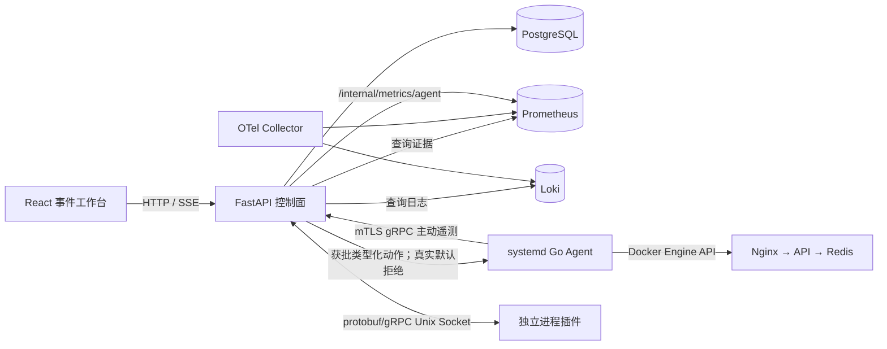

# AIOps Control Lab

一个为 AIOps、DevOps、SRE 学习和求职展示设计的单机可插拔运维系统。当前既有可重复的故障实验闭环，也能通过宿主机 systemd Agent 持续观察真实 Linux 与 devops-lab 容器；真实资产默认只观察，实验资产才允许故障注入和审批修复。

> English summary: A resource-aware, single-node AIOps lab featuring a Go host agent, Python control plane, React incident workbench, protobuf/gRPC process plugins, reproducible fault scenarios, approval integrity checks, and auditable remediation.

## 当前能力

- Go Agent 原生采集 Linux CPU、负载、内存、磁盘和 devops-lab 容器状态/资源，通过 mTLS gRPC 主动上报；控制面再向现有 Prometheus 暴露注册指标。
- Agent 使用 Docker Engine API 执行类型化动作，不接受任意 Shell；首版真实动作只允许 `lab-*` 实验资源。
- FastAPI 控制面按照领域层、应用层、端口与适配器分层，支持滚动 Z-Score 检测、Incident、证据引用、根因假设、修复计划和审批状态机。
- 审批使用稳定 SHA-256 内容哈希；下发任务再使用 HMAC-SHA256、短有效期、nonce 和双层幂等，防止批准后篡改、跨任务重放与重复执行。
- 正向步骤失败后，只按反向顺序执行计划中显式批准的类型化回滚动作，回滚结果进入同一审计记录。
- PostgreSQL 保存 Incident、计划、审批和 ActionRun；Prometheus、Loki、OpenTelemetry Collector 提供标准可观测设施。
- 独立进程插件使用 protobuf/gRPC 与 Unix Socket，提供 Go/Python SDK、配置 Schema、清单校验、跨平台契约测试、健康后原子替换和失败回滚。
- React/TypeScript 控制台提供总览、资产、拓扑、遥测、Incident、AI 诊断、审批、审计、插件、SRE、故障实验、算法与设置十三个页面。
- 真实资产页面展示 Agent 心跳/版本、稳定资产 ID、容器状态、四类拓扑关系、固定健康探针、规则评估和 Prometheus 历史趋势，并明确标记 `observe_only`。
- 三层实验拓扑由 Nginx、FastAPI 与 Redis 构成，提供 CPU、Redis 退出、API 退出、请求延迟和 HTTP 5xx 五类带真值、限时且可恢复的真实故障。
- 阶段二加入 EWMA、季节性基线、Isolation Forest、日志模板聚类、真实遥测证据、告警关联、图拓扑 RCA、混合 RAG、模型降级和受约束工具规划。
- 阶段三加入 SLO、容量和变更风险 API、通用 CI/CD 事件、Kubernetes/k3s 插件与主机白名单 Webhook 通知插件。

## 快速启动

要求 Linux、Docker Engine 与 Docker Compose。4 核 4GB 服务器可以运行默认配置，但不应同时部署 GitLab、Jenkins 等重型工具。

```bash
cd deployments
export POSTGRES_PASSWORD='请替换为随机长密码'
export AIOPS_ADMIN_TOKEN='请替换为随机长令牌'
export AIOPS_AGENT_SHARED_SECRET="$(openssl rand -hex 32)"
export AIOPS_LAB_CONTROL_TOKEN="$(openssl rand -hex 32)"
docker compose up --build -d
```

Web 和实验网关默认只监听服务器回环地址。远程使用前先建立 SSH 隧道：

```bash
ssh -L 8088:127.0.0.1:8088 用户名@服务器地址
```

保持 SSH 会话，在本机打开 `http://127.0.0.1:8088`。故障实验室可以注入 CPU、依赖不可用、容器退出、延迟和 5xx 场景，再进入审批中心执行预置修复。

安装并调用示例插件：

```bash
curl -X POST http://127.0.0.1:8088/api/v1/plugins/http-nginx/install \
  -H "Authorization: Bearer $AIOPS_ADMIN_TOKEN"
curl -X POST http://127.0.0.1:8088/api/v1/plugins/http-nginx/rpc/Analyze \
  -H "Authorization: Bearer $AIOPS_ADMIN_TOKEN" \
  -H 'Content-Type: application/json' \
  -d '{"url":"http://lab-gateway:8080/healthz"}'
```

停止环境：

```bash
docker compose down
```

普通停止不会删除 PostgreSQL、Prometheus 和 Loki 数据卷。只有明确执行 `docker compose down -v` 才会删除实验数据。

## 架构



控制面的核心依赖方向固定为：

```text
api/adapters → application → domain
                    ↓
                  ports
adapters ───────────┘
```

领域层不导入 FastAPI、psycopg、Docker SDK、gRPC 或具体模型客户端。更详细的数据流、难点和代码阅读顺序见[阶段一 README](docs/stages/01-mvp/README.md)。

## 本地开发与验证

```bash
python -m venv .venv
.venv/bin/pip install -e sdk/python -e 'control-plane[dev]'

cd control-plane && ../.venv/bin/python -m pytest
cd ../agent && go test ./...
cd ../web && pnpm install && pnpm run build
cd .. && .venv/bin/python scripts/check_chinese_docs.py
docker compose -f deployments/compose.yaml config --quiet
```

Windows PowerShell 将 `.venv/bin/python` 替换为 `.venv/Scripts/python.exe`。

已有 Prometheus/Grafana 的 4GB 服务器建议使用轻量覆盖文件。该模式不启动本项目自己的
Prometheus、Loki 和 OTel Collector；Web 与实验网关的调试端口只绑定宿主机回环地址：

```bash
cd deployments
docker compose -f compose.yaml -f compose.lite.yaml up --build -d
```

轻量模式不再把 Web 加入现有公网 Nginx 网络，也不加载
`deployments/nginx/aiops-location.conf`。Web 只发布到 `127.0.0.1:8088`，通过 SSH 隧道
获得加密传输；控制面、Agent、PostgreSQL、实验网关和 Docker Socket 均不直接暴露到公网。
未来正式演示必须先配置域名与 HTTPS，再显式使用公网覆盖文件。

## 阶段路线

| 阶段 | 状态 | 重点 |
|---|---|---|
| 01 垂直闭环 | 已实现 | 采集、异常、Incident、审批、Agent 修复、插件运行时、实验室 |
| 02 AI 核心 | 已实现 | EWMA、Isolation Forest、日志模板、Embedding、拓扑 RCA、RAG、评测 |
| 03 SRE 与生态 | 已实现主线 | SLO、容量、变更风险、CI/CD 事件、通知与 k3s/Kubernetes 插件 |
| 04 在线作品 | 已实现基础安全版 | 管理员边界、访客限流、真实实验故障、自动恢复和 HTTPS 覆盖 |
| 05 多页面私有控制台 | 已实现 | 十三页控制台、RAG 诊断 API、只读聚合查询、SSH 端口转发 |
| 06 真实环境持续监测 | 已部署，实时闭环验收通过，24 小时浸泡中 | systemd Agent、mTLS、真实资产/拓扑、规则迟滞、只观察门禁 |

本仓库不会用空类和虚假接口把后续阶段标记为完成；每个阶段必须同时具备代码、测试、阶段 README 和可复现验收证据。

## 安全声明

Agent 需要读取 Docker Socket，因此它拥有很高的本机权限。系统通过主动 mTLS、证书 CN 与节点 ID 绑定、类型化动作、审批哈希、HMAC、nonce、短有效期和幂等键降低风险。真实资产默认 `observe_only`，不会生成写计划；`approval_only` 首道门仍只允许只读动作。不要公开 9105、9443 或 8088，当前无域名部署只允许 SSH 端口转发访问。

## 文档

- [阶段一：刚需垂直闭环](docs/stages/01-mvp/README.md)
- [阶段二：AIOps 与 AI 核心](docs/stages/02-ai-core/README.md)
- [阶段三：SRE 指标与 Kubernetes 插件](docs/stages/03-sre-kubernetes/README.md)
- [阶段四：公网沙箱与开源交付](docs/stages/04-public-demo/README.md)
- [阶段五：多页面私有控制台](docs/stages/05-private-console/README.md)
- [阶段六：真实环境持续监测与安全运维](docs/stages/06-real-monitoring/README.md)
- [完整代码阅读顺序](docs/code-reading-order.md)
- [架构与数据流](docs/architecture.md)
- [ADR-001：模块化单体与端口适配器](docs/adr/001-modular-monolith.md)
- [ADR-002：独立进程 gRPC 插件](docs/adr/002-grpc-process-plugins.md)
- [ADR-003：Agent 主动 mTLS gRPC 长连接](docs/adr/003-agent-mtls-active-stream.md)
- [贡献与代码质量规范](CONTRIBUTING.md)
- [Go/Python 插件 SDK 与开发脚手架](sdk/README.md)
- [腾讯云 4GB 主机轻量部署记录](docs/deployments/tencent-cloud-lite/README.md)
