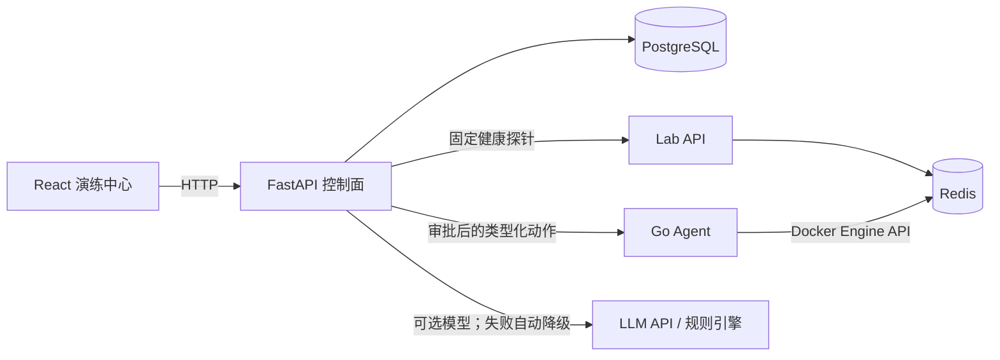

# AIOps Control Lab

一个面向 DevOps/AIOps 求职展示的可重复故障演练平台。默认演示只讲一条主线：

> Redis 依赖中断 → API 健康探针返回 503 → 创建 Incident → AI/规则诊断 → 人工审批 → 恢复 Redis → 健康复检

系统不会把模型回答直接当成命令执行。所有修复动作都必须转换为固定类型、经过人工审批，并在执行后重新验证业务健康状态。

## 5 分钟演示

要求：Linux、Docker Engine、Docker Compose，建议至少 4 核 4GB。

```bash
git clone https://github.com/SSSSS0828/aiops-control-lab.git
cd aiops-control-lab/deployments
cp ../.env.example ../.env
docker compose --env-file ../.env up --build -d
```

打开 `http://127.0.0.1:8088/#/demo`，按页面提示完成：

1. 停止实验环境中的 `lab-redis`，不影响真实资产。
2. 控制面轮询固定的 `lab-api /healthz`，确认真实返回 HTTP 503。
3. 根据实际观测值建立 Incident，并将证据交给模型或规则引擎。
4. 人工批准固定的容器恢复动作。
5. Agent 恢复 Redis；控制面同时验证容器状态和 API 依赖健康。

没有配置大模型密钥时，系统会明确显示“规则降级”，演示仍能完整运行。若需要接入 OpenAI-compatible API，在 `.env` 中配置：

```dotenv
AIOPS_LLM_BASE_URL=https://example.com/v1
AIOPS_LLM_API_KEY=replace-me
AIOPS_LLM_MODEL=replace-me
```

停止环境不会删除数据卷：

```bash
docker compose --env-file ../.env down
```

## 为什么选择 Redis 故障

实验链路为 `Nginx → FastAPI → Redis`。Redis 停止后，API 进程仍然存活，但依赖健康检查会返回 503，可以清楚展示“进程存活不等于服务可用”，也能验证根因定位和恢复检查是否真的覆盖了下游依赖。

## 核心架构



关键安全边界：

- 实验接口只接受代码中登记的故障场景，不能传入任意命令、容器或 URL。
- 真实资产默认 `observe_only`；访客只能操作 `lab-*` 实验资源。
- 修复计划使用内容哈希，Agent 任务使用短有效期签名和幂等键。
- 只有动作成功且业务健康复检通过，Incident 才会进入 `resolved`。

## 工程质量

```bash
python -m venv .venv
.venv/bin/pip install -e sdk/python -e 'control-plane[dev]'
cd control-plane && ../.venv/bin/python -m pytest
cd ../agent && go test ./...
cd ../web && pnpm install && pnpm run test && pnpm run build
cd .. && docker compose -f deployments/compose.yaml config --quiet
```

GitHub Actions 分别验证 Python、Go、React、文档和 Compose 配置。

## 高级能力

默认界面把以下能力收进“高级能力”，代码和测试均保留：

- Linux/Docker Go Agent 与真实资产观察模式
- Prometheus、Loki、OpenTelemetry 遥测
- 滚动 Z-Score、EWMA、季节性基线和 Isolation Forest 实验
- 日志模板、告警关联、拓扑辅助根因分析和混合检索
- SLO、容量预测、变更风险、插件 SDK 和 Kubernetes 插件
- mTLS gRPC Agent 长连接、审批完整性、幂等执行与审计

详细资料：

- [面试讲解指南](docs/interview-guide.md)
- [架构与数据流](docs/architecture.md)
- [完整代码阅读顺序](docs/code-reading-order.md)
- [阶段一：垂直闭环](docs/stages/01-mvp/README.md)
- [阶段六：真实环境持续监测](docs/stages/06-real-monitoring/README.md)

## 项目边界

这是单机学习与作品展示项目，不是生产级自动修复平台。当前同步执行模型适合小规模演示；真实生产环境还需要独立身份系统、队列、高可用数据库、完整审计留存和更严格的变更治理。
