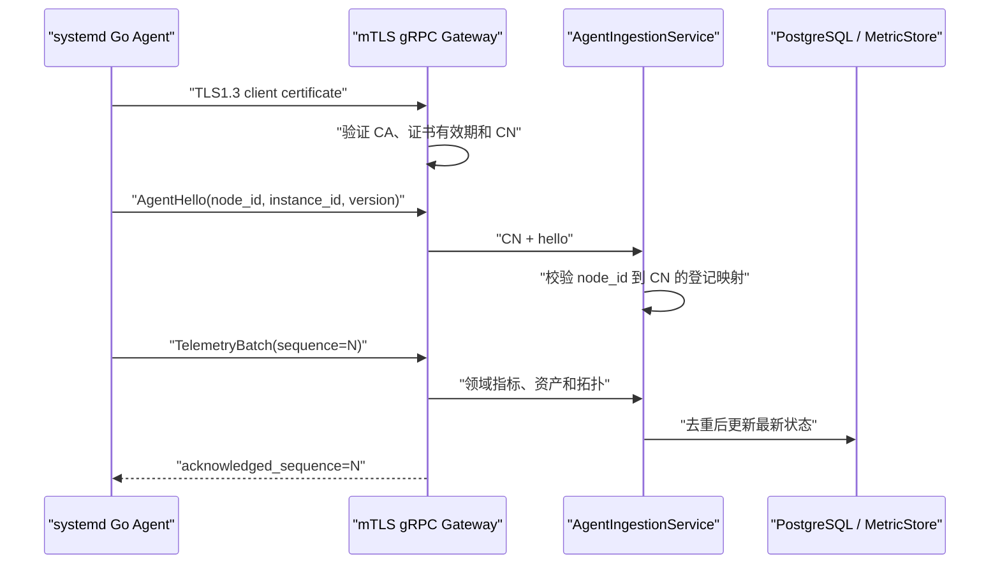

# ADR-003：Agent 主动 mTLS gRPC 长连接

## 状态

已采纳。阶段六保留旧回环 HTTP 作为迁移回滚通道，新部署的数据面使用 Agent 主动连接。

## 背景

阶段五 Agent 位于 Compose 私网，由控制面通过 HTTP 调用。该方式适合实验室，却不能准确
表达“被管理节点主动注册”，也会迫使远程部署开放 Agent 入站端口。仅使用 HMAC 可以证明
任务内容来自共享密钥持有者，但不能提供独立节点证书身份、传输机密性和双向认证。

## 决策

- Agent 以 systemd 服务运行，只向 `127.0.0.1:9443` 建立 mTLS gRPC 双向流。
- Compose 在宿主机只发布 `127.0.0.1:9443:9443`；容器内服务监听 `0.0.0.0:9443`。
- 首帧必须是 `AgentHello`。控制面同时校验证书 CN 和 `hello.node_id` 的登记映射。
- 遥测使用 `instance_id + sequence` 去重；旧序列仍返回确认，让断线 Agent 继续推进。
- mTLS 不替代任务安全字段。任务继续包含批准内容哈希、HMAC、nonce、有效期和幂等键。
- 协议使用强类型 Protobuf，不再使用 `google.protobuf.Struct` 传递任意字典。

## 数据与信任流

## 取舍

主动流避免开放每个 Agent 的入站端口，也便于以后跨 NAT 管理节点。代价是证书生命周期、
流重连和双语言协议生成更加复杂。单机阶段使用独立本地 CA；正式多节点环境应改接组织 PKI，
并增加证书吊销、轮换告警和短生命周期签发。

## 失败与回滚

- 证书无效或 CN 不匹配：gRPC 握手或应用身份校验失败，控制面不保存节点。
- 控制面不可用：Agent 以 1、2、4 秒递增退避，最大 30 秒，不缓存无边界原始数据。
- 确认丢失：Agent 重发同一序列，控制面确认但不重复写入。
- 升级失败：停止 systemd Agent，并继续使用 Compose 内旧 Agent 处理 `lab-*` 实验闭环；真实
  资产保持不可写，不会影响 `/srv/devops-lab` 业务容器。
