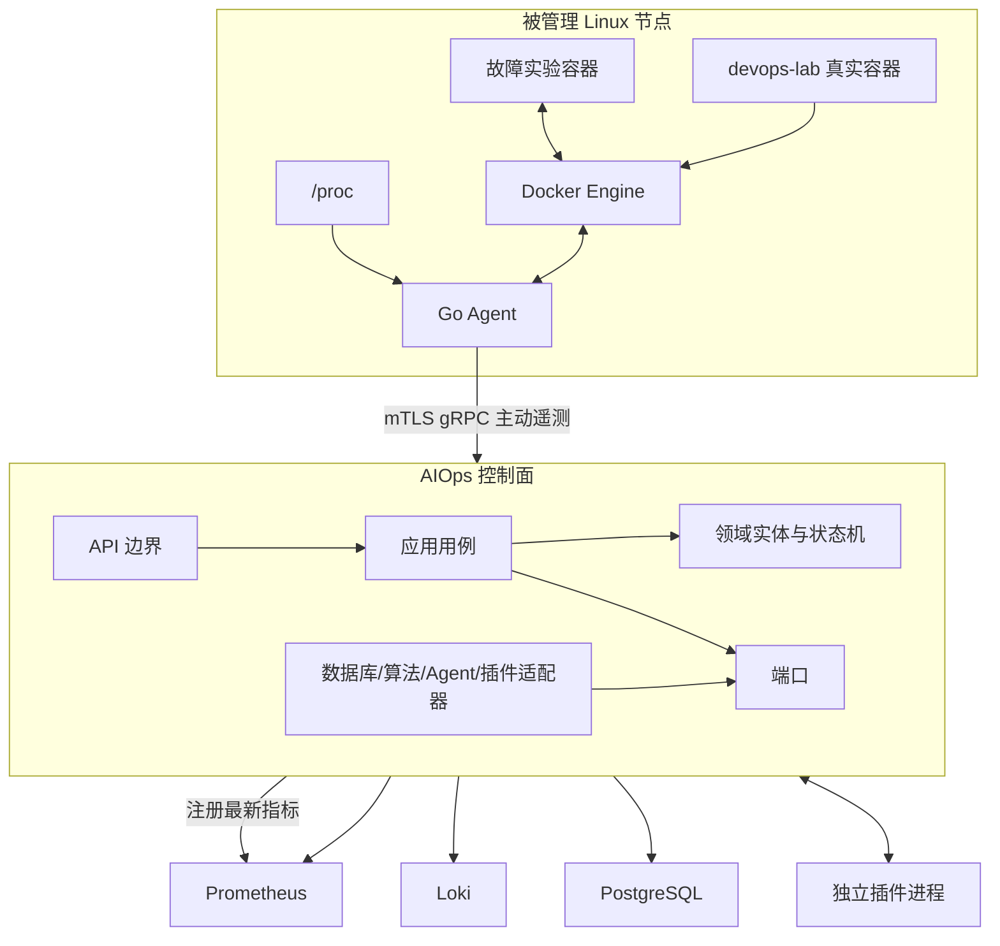
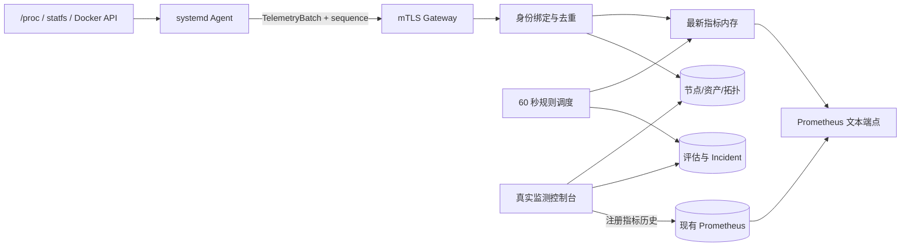
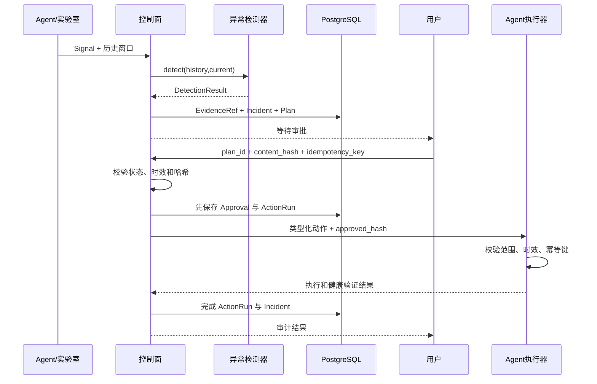
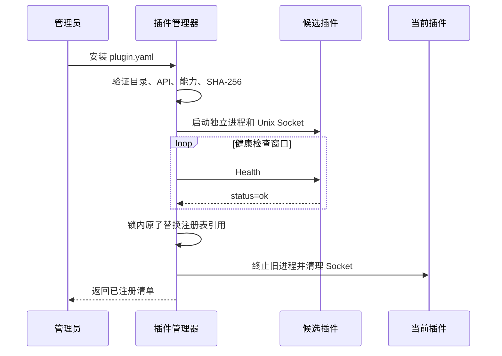

# 架构与数据流

## 组件边界

控制面负责认知和决策，Agent 负责靠近系统的采集和动作，插件负责厂商或协议适配，Prometheus/Loki 负责保存高体积遥测。任何一个组件都不能同时承担“算法决策”和“绕过审批执行系统命令”。

真实资产与实验资产使用互斥命名空间：`host/*` 和 `docker/devops-lab/*` 属于真实环境，
`lab-*` 属于自动重置故障实验。`AIOPS_REAL_ACTIONS_MODE=observe_only` 时，控制面应用策略与
Agent 都拒绝真实动作；页面上的禁用提示不是安全边界。

## 真实监测数据流

详细安全、部署和回滚见阶段六 README 与 ADR-003。

## Incident 数据流

## 插件升级数据流

候选插件在健康之前不会替换旧版本；启动失败、进程提前退出或健康超时只清理候选版本。控制面与旧插件继续提供服务。
