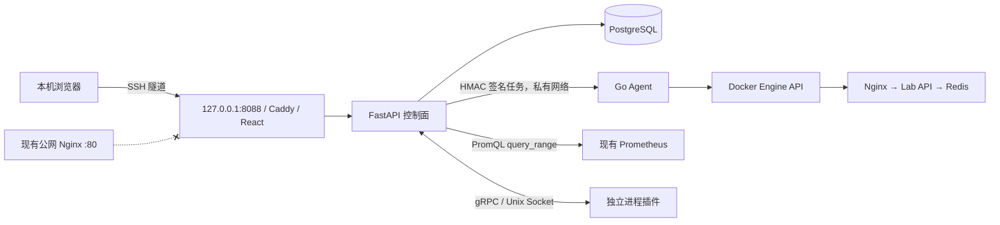

# 腾讯云 4GB 主机轻量部署记录

## 目标与状态

部署日期：2026-08-23。

目标是在一台已经运行 Nginx、Prometheus、Grafana 和 Alertmanager 的 4 核 4GB Ubuntu
服务器上部署 AIOps 核心闭环，不中断或覆盖原有服务。项目安装目录为
`/home/ubuntu/aiops`，当前运行态验收已经通过。

服务器公网地址、管理员令牌和数据库密码不写入仓库。密钥只保存在服务器的
`/home/ubuntu/aiops/.env`，权限为 `0600`。

## 部署架构与数据流



一次故障演练的数据路径为：使用者通过 SSH 加密隧道进入 Web，同源转发到控制面；控制面让 Agent
停止白名单内的实验依赖，异常信号生成 Incident 和修复计划；重复异常先经过五分钟窗口、
直接拓扑邻居和三十分钟变更关联；审批请求携带内容哈希；控制面再为每个 Agent 任务加入
短有效期、nonce 和 HMAC-SHA256 签名。Agent 执行类型化重启与健康检查；ActionRun、
Incident、回滚结果和审计记录写回 PostgreSQL。指标证据通过 Prometheus `query_range`
实时读取，Incident 只保存查询条件、窗口和摘要，不复制原始样本。

## 轻量模式取舍

`deployments/compose.lite.yaml` 为 Prometheus、Loki 和 OTel Collector 增加
`observability` profile，默认不启动它们，避免与服务器现有监控栈重复。Web 的调试端口为
`127.0.0.1:8088`，实验网关为 `127.0.0.1:18080`。Web 只加入
`aiops-lab_default` 项目私网，不加入现有公网 Nginx 的 `devops-lab_default` 网络。
控制面设置 `AIOPS_ACCESS_MODE=private-forward`、`AIOPS_TRUST_X_REAL_IP=false`；SSH 隧道
提供传输加密，但管理员接口仍必须另行提供 Bearer Token。
控制面与 Agent 从 `.env` 读取相同的 `AIOPS_AGENT_SHARED_SECRET`，该值至少 32 个字符；
Agent 缺失密钥时会拒绝启动，不会退化为匿名 HTTP 执行器。
实验 API 另用 `AIOPS_LAB_CONTROL_TOKEN` 保护私网故障开关，避免复用 Agent 高权限密钥。

当前核心容器为：Web、控制面、Agent、PostgreSQL、Lab Nginx、Lab API 和 Lab Redis。
需要完整观测栈时可以显式加入 `--profile observability`，但必须先重新评估内存。

## 部署命令

```bash
cd /home/ubuntu/aiops
docker compose --env-file .env \
  -f deployments/compose.yaml \
  -f deployments/compose.lite.yaml \
  up -d --build
```

首次部署必须在服务器本地生成独立密钥，且不要输出到终端日志：

```bash
umask 077
printf 'AIOPS_AGENT_SHARED_SECRET=%s\n' "$(openssl rand -hex 32)" >> .env
printf 'AIOPS_LAB_CONTROL_TOKEN=%s\n' "$(openssl rand -hex 32)" >> .env
chmod 0600 .env
```

如果 `.env` 已存在该变量，不要重复追加；控制面和 Agent 必须使用完全相同的值。

查看状态和日志：

```bash
docker compose --env-file .env \
  -f deployments/compose.yaml \
  -f deployments/compose.lite.yaml ps

docker compose --env-file .env \
  -f deployments/compose.yaml \
  -f deployments/compose.lite.yaml logs --tail=200
```

远程使用时从自己的电脑建立临时隧道：

```bash
ssh -L 8088:127.0.0.1:8088 ubuntu@<服务器公网 IP>
```

保持 SSH 会话并访问 `http://127.0.0.1:8088`。关闭 SSH 后访问立即失效，云安全组不需要
也不应该开放 TCP 8088。

安全停止但保留 PostgreSQL 数据卷：

```bash
docker compose --env-file .env \
  -f deployments/compose.yaml \
  -f deployments/compose.lite.yaml down
```

不要使用 `down -v`，除非明确决定删除 Incident、审批和审计数据。

## 构建难点与解决方案

第一次控制面构建在 `pip install /sdk` 停留超过五分钟。测速表明官方 PyPI 在该云主机
只有约 9KB/s，而清华镜像约为 900KB/s。解决方式是在 Dockerfile 中提供默认值仍为官方
PyPI 的 `PIP_INDEX_URL` 构建参数，仅由轻量 Compose 覆盖为国内镜像。这样不会把特定
区域的网络策略硬编码进通用镜像，也使 SDK 安装从五分钟以上缩短到约六秒。

Compose 默认没有读取项目根目录 `.env`。密钥哨兵在启动前检测到示例密码仍存在并主动
终止，没有创建运行容器。最终所有部署命令显式使用 `--env-file .env`，避免因工作目录
变化静默回退到不安全默认值。

## 验收证据

- 7 个核心容器全部处于运行状态，关键依赖健康检查通过，重启次数均为 0。
- Web 控制面 `/healthz`、实验网关 `/healthz` 和 Incident API 返回成功。
- 注入 `dependency_unavailable` 后创建 Incident 和修复计划。
- 审批哈希校验通过，Agent 恢复 `lab-redis`，ActionRun 为 `succeeded`。
- 两次相邻 CPU 异常复用同一 Incident 和同一计划，证据数从 1 增加到 2。
- 控制面查询服务器现有 Prometheus 的 `up` 指标，返回 11 个真实样本及标签摘要。
- Python 控制面 48 个、实验状态 3 个、多场景数据集 2 个测试通过；Go 验签、防重放、并发幂等和跨语言签名向量测试通过。
- 公网真值目录返回 5 个场景；CPU 注入时 `lab-api` 实测约 25.21% CPU，修复后恢复。
- Redis 退出与 API 退出均产生网关 504，延迟场景实测约 2.00 秒，5xx 场景返回 503；四类修复 ActionRun 均为 `succeeded`，网关最终都恢复 200。
- Incident 最终进入 `resolved`，实验 API 再次确认 Redis 依赖健康。
- HTTP/Nginx 插件真实启动为独立进程，`Health` RPC 返回 `ok`。
- 核心容器 RSS 快照合计约 193MiB，宿主机仍有约 1.47GiB 可用内存。
- 未启动本项目的 Prometheus、Loki 和 OTel Collector，未发现 Traceback、panic 或 fatal。
- 多页面控制台包含十三个业务页面；SSH 隧道下首页、健康接口和总览 API 均返回成功。
- Web 只属于 `aiops-lab_default`，宿主机只监听 `127.0.0.1:8088`；公网 `/aiops/` 返回 404。

## 安全边界与下一步

无域名阶段不提供公网 AIOps 入口。Web `8088` 与实验网关 `18080` 都只绑定服务器回环
地址；Agent、PostgreSQL 和 Docker Socket 仍不发布端口。SSH 隧道提供临时加密访问，
但控制台仍遵守人工审批、最小权限和不向浏览器返回密钥的约束。

Agent 当前在 Compose 私有网络内使用 HMAC-SHA256 认证的受控 HTTP 调度，已经具备来源
认证、内容完整性、短有效期、nonce 防重放和幂等保护，但 HMAC 不提供传输加密，也不等同
于计划中的主动 mTLS gRPC 长连接。因此本次部署成功不能视为生产安全验收。Kubernetes
插件也尚未在真实 k3s 集群执行 RBAC 集成测试。

### Agent 密钥轮换与失败处理

当前共享密钥轮换需要控制面和 Agent 同一次 Compose 更新，不支持双密钥重叠窗口。更新前
先备份 `.env`，生成新值后只重建 `control-plane` 与 `agent`；若健康检查失败，恢复旧 `.env`
并再次重建这两个服务。因为 Agent 任务有效期最多两分钟，轮换前不应存在正在执行的动作。
后续 mTLS 阶段将改为节点证书、证书序列号吊销和可重叠轮换。

### Nginx bind mount 热更新陷阱

早期公网演示使用 `/aiops/` location。切换私有控制台时，先下载运行中的真实配置并删除
唯一 AIOps block，使用临时 Nginx 容器加入真实网络执行 `nginx -t`，然后再覆盖并 reload。
服务器保留 `default.conf.pre-private-console-20260823` 作为回滚文件；原站点根路径保持 200，
公网 `/aiops/` 已返回 404。

### Web 容器重建后的 Docker DNS 缓存

该问题只适用于未来恢复公网演示：更新前端会重建 `aiops-web` 容器并改变其私网 IP，静态
`proxy_pass` 可能继续使用旧地址。当前 Web 不属于公网 Nginx 网络，不需要为 AIOps reload。
未来重新启用入口时，每次重建 Web 后必须执行：

```bash
docker exec devops-nginx nginx -t
docker exec devops-nginx nginx -s reload
```

配置测试成功后 reload 会重新解析 `aiops-web`，无需重建 Nginx，原站点连接只发生平滑
worker 切换。后续若能修改完整入口配置，可用 Docker DNS resolver 与动态 upstream 消除
这一人工步骤；在没有完成真实配置测试前不应直接改写生产 upstream 语义。
