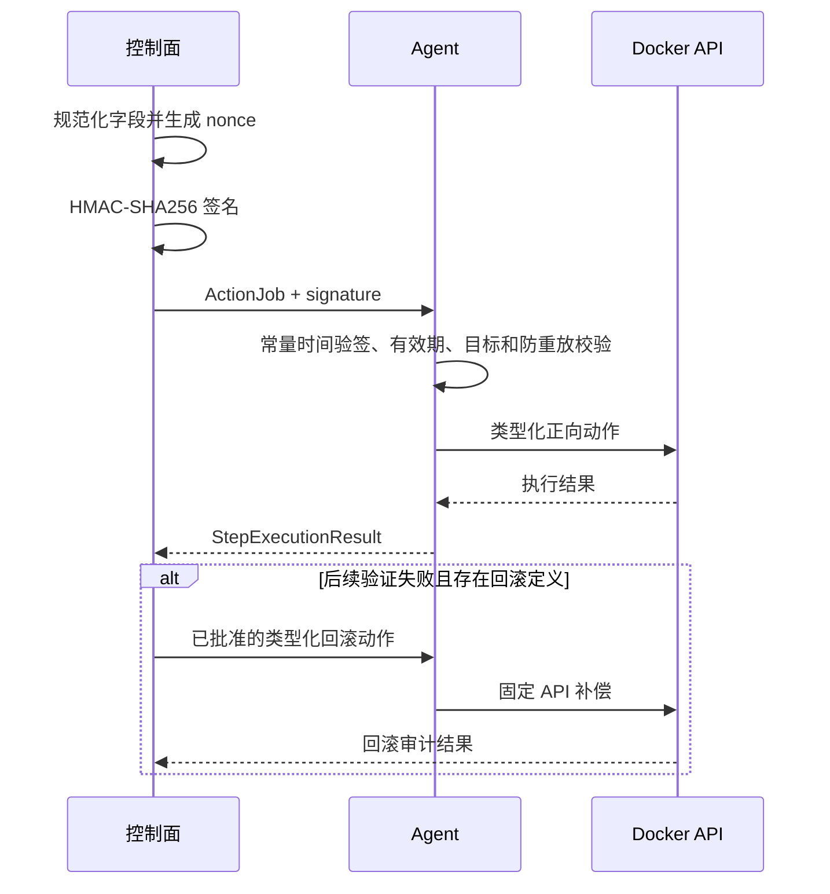
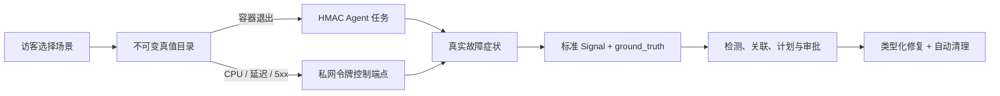
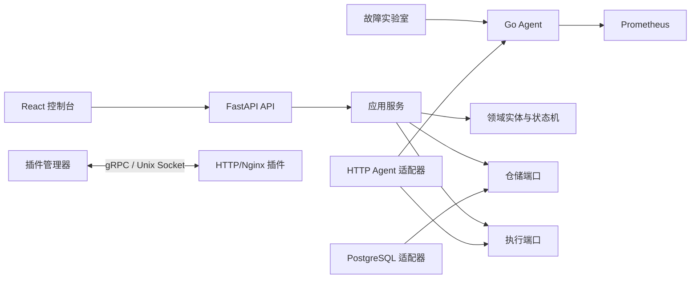

# 阶段一：刚需垂直闭环

## 阶段状态与验收

状态：代码实现、静态检查与单元测试均已通过，并已在 4 核 4GB Ubuntu 云服务器完成真实 Docker Compose 部署、故障注入、修复、Prometheus 查询和公网只读访问验收。

本阶段目标是证明系统不是普通监控面板，而是能完成“发现、解释、审批、执行、验证、审计”的 AIOps 最小闭环，同时证明插件可以独立进程热加载。

完成标准：

- 一个命令启动控制面、Agent、观测设施和三层实验服务。
- 注入 CPU 突增或依赖不可用后创建带证据的 Incident。
- 修复计划展示目标、风险、参数、预期结果和显式类型化回滚动作。
- 用户批准的内容哈希与执行内容一致，重复请求不会重复执行。
- Agent 只操作 `lab-*` 容器，修复后再次检查容器运行状态。
- HTTP/Nginx 插件可在控制面不重启时安装；候选插件不健康时不会替换当前版本。

## 新增组件与职责

| 组件 | 技术 | 单一职责 |
|---|---|---|
| Go Agent | Go 标准库、Docker Engine API、procfs | 节点采集与类型化动作执行 |
| 控制面 | Python 3.12、FastAPI、Pydantic | Incident、审批和执行用例编排 |
| 领域层 | Python dataclass、Enum | 状态机、不变量和稳定实体 |
| 数据层 | PostgreSQL JSONB | 保存聚合、审批事实和幂等记录 |
| 指标与日志 | Prometheus、Loki、OTel Collector | 保存和查询高体积遥测数据 |
| 插件运行时 | protobuf、gRPC、Unix Socket | 插件校验、隔离、健康与原子升级 |
| Web 控制台 | React 19、TypeScript、Vite | 事件、证据、根因与审批交互 |
| 故障实验室 | Nginx、FastAPI、Redis | 生成可重复依赖链和故障真值 |
| 单机交付 | Docker Compose、Caddy | 资源受限环境的一键部署与同源入口 |

## 详细数据流

### 1. 观测与异常检测

1. Agent 从只读挂载的宿主机 `/proc` 读取一分钟负载、总内存和可用内存。
2. Agent 将指标按 Prometheus 文本格式暴露在内部 9105 端口，Prometheus 每 15 秒抓取一次。
3. 阶段一演示入口把当前值和历史窗口转换成 `Signal`，应用服务调用 `RollingZScoreDetector`。
4. 检测器只返回 `DetectionResult`，不创建告警、不访问仓储，因此以后可以直接替换为 EWMA 或 Isolation Forest。
5. 异常时应用服务创建 `EvidenceRef`。它只保存 PromQL、时间窗口和摘要，不复制原始指标。
6. 同一用例创建 `Incident`、阶段一根因 `Hypothesis` 和 `RemediationPlan`，最后将 Incident 转为 `waiting_approval`。

### 2. 审批与完整性

1. 浏览器读取计划及服务端计算的 `content_hash`。
2. 哈希输入只包含 Incident、摘要、风险和有序修复步骤；状态和时间不参与哈希。
3. 用户批准时提交计划 ID、批准者、内容哈希和幂等键。
4. 控制面先查询幂等键，再检查计划状态、服务端 UTC 有效期和重新计算的哈希。
5. 所有校验通过后，先持久化不可变 `Approval`，再把 Incident 置为修复中。
6. `ActionRun` 在系统调用之前落库，进程异常时仍能看到未结束任务。

### 3. Agent 执行与验证

1. 控制面将每个 `RemediationStep` 转成短有效期 `ActionJob`，携带批准哈希、稳定幂等键和 128 位随机 nonce。
2. 控制面规范化任务字段并用部署时共享密钥计算 HMAC-SHA256；动作、目标、参数、有效期和审批哈希都受签名保护。
3. Agent 先以常量时间比较验签，再校验 SHA-256 格式、任务有效期、`lab-*` 目标范围和幂等记录。
4. Agent 将 nonce 绑定到首个幂等键；相同任务可以安全重试，改投其他幂等键的重放会被拒绝。
5. Agent 不执行 Shell，而是把 `restart_container` 映射到固定 Docker Engine API。
6. 重启成功后，第二个 `health_check` 步骤查询容器状态并要求其为 `running`。
7. 任一步骤失败都会停止正向执行，并按反向顺序运行已经成功步骤中显式声明的类型化回滚动作。
8. 正向与回滚输出一起写入 ActionRun；回滚成功使用 `rolled_back`，回滚缺失或失败则进入 `failed` 并要求人工接管。

### 任务认证与失败补偿时序



### 4. 插件热更新

1. 管理员只传入合法插件 ID，控制面从固定根目录定位 `plugin.yaml`。
2. 运行时验证路径未逃逸、API 版本受支持、能力在白名单内、入口 SHA-256 完全一致。
3. 候选插件使用版本化 Unix Socket 启动，控制面轮询标准 `Health` RPC。
4. 候选健康后只在锁内交换注册表引用，再停止旧进程；候选失败则删除候选并保留旧版本。

### 5. 五类故障真值与自动清理

| 场景 ID | 实际注入方式 | 真值根因 | 主要症状 | 默认修复 |
|---|---|---|---|---|
| `container_cpu_spike` | 实验 API 单线程约 25% 单核占空比，最多 30 秒 | `lab-api` | 容器 CPU 突增 | 重启并健康检查 |
| `dependency_unavailable` | 签名 Agent 任务停止容器 | `lab-redis` | API 健康接口 503 | 重启依赖并健康检查 |
| `api_container_exit` | 签名 Agent 任务停止容器 | `lab-api` | 网关上游不可用 | 重启 API 并健康检查 |
| `request_latency` | 实验 API 在请求路径固定等待 2 秒 | `lab-api` | 请求耗时升高 | 重启清除进程内状态 |
| `http_5xx` | 实验 API 受控返回 503 | `lab-api` | HTTP 5xx 比率升高 | 重启清除进程内状态 |

应用故障控制端点只存在于 Compose 私有网络，并要求独立
`AIOPS_LAB_CONTROL_TOKEN`。所有状态都有 120 秒以内的硬截止时间；控制面的后台清理再提供
第二层恢复保障。容器停止类场景通过 Agent HMAC 任务执行，仍受目标白名单和幂等约束。
公网返回的 `ground_truth` 包含场景、根因资产、注入类型和期望修复，使检测结果与真实标签能
直接比较，而不是从 Incident 标题猜测。



## 架构与接口



关键接口包括：

- `AnomalyDetector.detect(history, current)`：统一异常检测算法。
- `IncidentRepository`：保存和查询 Incident。
- `RemediationRepository`：保存计划、审批和 ActionRun，并按幂等键查询。
- `ActionDispatcher.execute(step, approved_hash)`：隔离应用层与 Agent 传输。
- `PluginService`：定义 Describe、Health、Discover、Analyze、Plan、Execute、Verify 和 Rollback。

## 核心算法

滚动 Z-Score 使用历史窗口均值与总体标准差衡量当前值偏离程度：

```text
mean = sum(history) / n
std  = sqrt(sum((x - mean)^2) / n)
z    = abs(current - mean) / std
```

- 输入：至少 5 个历史样本和一个当前样本。
- 输出：是否异常、分数和包含方向的解释。
- 时间复杂度：`O(n)`；空间复杂度：`O(1)`，不计调用方传入窗口。
- 零方差：稳定基线发生任何变化时返回异常；完全一致时返回正常。
- 局限：不能处理季节性和趋势，对窗口选择敏感；阶段二将加入 EWMA、季节性基线和 Isolation Forest 对比。

## 关键代码阅读顺序

1. `control-plane/src/aiops_control/domain/models.py`：先理解领域实体、状态机和计划哈希。
2. `control-plane/src/aiops_control/application/incident_service.py`：阅读信号如何变成 Incident 与计划。
3. `control-plane/src/aiops_control/application/remediation_service.py`：逐行阅读审批、幂等执行和状态收敛。
4. `agent/internal/application/action_service.go`：理解第二层安全校验和并发幂等。
5. `agent/internal/adapters/docker/executor.go`：理解类型化动作如何映射为 Docker API。
6. `control-plane/src/aiops_control/adapters/grpc_plugin_runtime.py`：理解候选启动与原子升级。
7. `web/src/App.tsx`：查看浏览器如何编排故障注入、计划加载、审批和刷新。

## 架构难点与取舍

### 审批后内容不可变化

难点不是“增加一个确认按钮”，而是证明 Agent 执行的正是用户看到的内容。计划采用稳定 JSON 序列化和 SHA-256；控制面审批时重新计算。任务信封再以 HMAC-SHA256 签名，Go 与 Python 各自维护相同固定向量测试，避免序列化规则漂移。HMAC 解决来源认证和内容完整性，但不提供链路机密性，后续仍需主动 mTLS gRPC 长连接。

### 幂等边界跨越控制面与 Agent

浏览器可能重试，控制面也可能因超时重发。控制面以请求幂等键保存 `ActionRun`，Agent 再以计划哈希、动作和目标形成步骤级幂等键。两层都检查，避免重启等状态变更被执行两次。

### 回滚不能靠动作名称猜测

重启容器无法恢复进程重启前的内存状态，因此默认重启计划不伪造“恢复旧容器”动作。只有计划明确给出 `rollback_action` 与 `rollback_arguments` 时才自动补偿；补偿失败后继续尝试更早步骤，以尽量缩小残留影响，同时把每一步结果留给人工接管。

### 热更新不能先停止旧版本

如果先停旧插件再启动新插件，新版本配置错误会造成能力中断。当前运行时先启动带版本 Socket 的候选，健康后原子替换注册表，再清理旧版本。

### 4GB 内存预算

控制面采用模块化单体，不引入消息队列；前端静态托管；Agent 只依赖 Go 标准库。Compose 上限约为：控制面 512MB、Prometheus 512MB、Loki 512MB、PostgreSQL 384MB、OTel 256MB、Agent 96MB、Web 96MB、实验室 288MB，总上限约 2.65GB，给操作系统和页缓存保留空间。

## 安全、降级与回滚

- 大模型尚未成为执行依赖；模型不可用不会阻断规则检测和预置 Runbook。
- 控制面未配置 `DATABASE_URL` 时回退内存仓储，适用于测试，不适合长期运行。
- 控制面未配置 `AIOPS_AGENT_URL` 时使用安全演示执行器，不操作 Docker。
- Agent 9105 端口只存在于 Compose 内部网络，不在宿主机发布。
- 插件入口必须通过 SHA-256；修改源码后需重新计算清单值，否则安装失败。
- Agent 共享密钥至少 32 个字符，Compose 两端从同一个 `.env` 注入；缺失时 Agent 拒绝启动。
- HMAC 不加密 HTTP 内容，因此 Agent 端口仍只能位于私有网络，公网管理入口在明文 HTTP 模式下保持关闭。
- 当前 Docker Socket 权限等价于高权限，真实生产接入仍必须增加 mTLS、Docker Socket Proxy 或独立特权助手。
- 显式回滚成功时 ActionRun 为 `rolled_back`；未定义、部分失败或无法验证时 Incident 为 `failed` 并要求人工接管。

## 部署、测试与演示

启动与查看状态：

```bash
cd deployments
export POSTGRES_PASSWORD='随机长密码'
export AIOPS_AGENT_SHARED_SECRET="$(openssl rand -hex 32)"
export AIOPS_LAB_CONTROL_TOKEN="$(openssl rand -hex 32)"
docker compose up --build -d
docker compose ps
docker compose logs -f control-plane agent
```

验证实验拓扑：

```bash
curl http://127.0.0.1:18080/healthz
docker stop lab-redis
curl -i http://127.0.0.1:18080/healthz
docker start lab-redis
```

质量检查：

```bash
cd control-plane && ../.venv/bin/python -m pytest
../.venv/bin/python -m ruff check src tests
../.venv/bin/python -m mypy src
cd ../agent && go test ./... && go vet ./...
cd ../web && pnpm run build
cd .. && .venv/bin/python scripts/check_chinese_docs.py
docker compose -f deployments/compose.yaml config --quiet
```

## 测试结果与已知限制

- Python 控制面：45 个测试通过，覆盖领域、审批、自动回滚、任务签名、代理头防伪、五类真值、遥测查询和 API 闭环。
- 实验室与数据集：3 个故障状态测试、2 个多场景数据集测试通过。
- Go：验签、跨语言固定向量、防重放、并发幂等和目标白名单测试通过，`go vet` 通过。
- Web：ESLint、Prettier、Vitest、TypeScript 严格检查和 Vite 生产构建通过。
- Compose：配置解析通过；腾讯云 Ubuntu 主机 7 个核心容器运行验收通过。
- 插件：三个官方插件均通过真实独立进程、gRPC/Unix Socket、Health、Describe 和清理契约测试。
- 当前异常数据由 API 演示入口直接提供历史窗口；下一阶段改为控制面查询 Prometheus 窗口。
- 阶段二已实现五分钟窗口去重、直接拓扑邻居关联、三十分钟变更关联和计划复用。
- PostgreSQL 使用 JSONB 聚合适合 MVP；稳定跨聚合查询出现后再通过迁移拆出规范化字段。

## 学习与面试要点

- AIOps：遥测、证据引用、异常检测、Incident、根因假设和修复闭环。
- DevOps：Docker Engine API、Compose、健康检查、配置与一键交付。
- SRE：故障实验、风险边界、幂等性、降级、验证和审计。
- 软件架构：领域层、端口适配器、模块化单体、插件生命周期和 ADR。
- AI 基础：统计异常分数、可解释输出、真值数据与后续算法评测接口。
- 安全：TOCTOU 风险、内容哈希、最小权限、允许列表、任务有效期和提示词不能直接变成命令。

## 下一阶段预留

- `AnomalyDetector` 允许加入 EWMA、季节性和 Isolation Forest。
- `EvidenceRef` 可引用 Loki 日志和变更事件，而不改变 Incident 模型。
- `Hypothesis` 已支持多根因评分和证据列表，可接入拓扑图算法。
- `ActionDispatcher` 可从阶段一 HTTP 适配器替换为 Agent 主动 mTLS gRPC 长连接。
- 插件协议保留 Analyze、Knowledge 和 Notify 等能力，下一阶段增加日志解析、RAG 和通知插件。
- 本阶段明确不实现 Kubernetes、SLO、容量预测、Embedding、RAG 和 LLM 自动规划。
