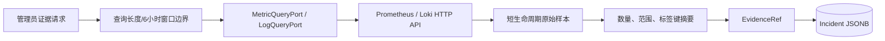
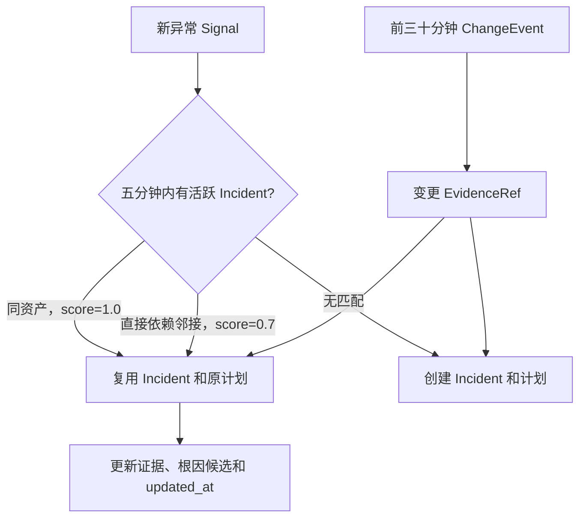
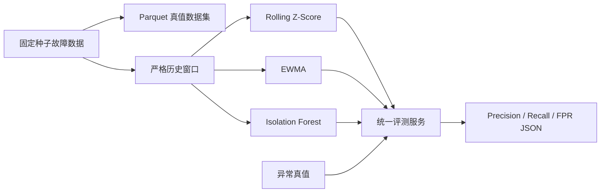
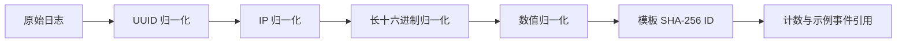
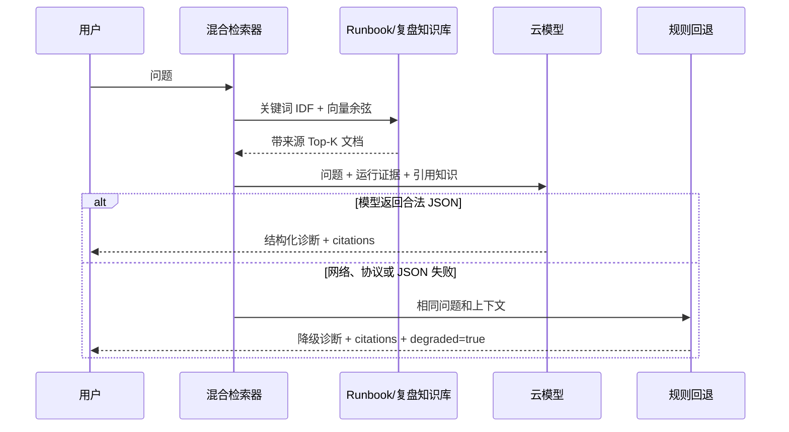

# 阶段二：AIOps 与 AI 核心

## 阶段状态与验收

状态：核心代码、45 个控制面测试、Ruff、严格 Mypy 和第一版检测器对比实验均已完成。深度自编码器脚本已实现，但因其依赖 PyTorch，不进入默认控制面环境，也不在 4GB 在线服务中训练。

本阶段把阶段一的单一 Z-Score 扩展为可比较的异常检测、日志模板化、依赖图 RCA、混合 RAG、OpenAI-compatible 诊断、规则降级和受约束工具规划。所有模型输出仍停留在“建议”层，必须转换为修复计划并经过审批才能进入 Agent。

## 新增模块与技术

| 能力 | 技术 | 目的 |
|---|---|---|
| 趋势检测 | EWMA 均值与方差递推 | 适应缓慢变化的在线负载 |
| 季节检测 | 同季节位置统计基线 | 比较相同小时或星期位置 |
| 无监督检测 | 自研一维 Isolation Forest | 学习随机隔离与无标签异常检测 |
| 日志结构化 | Drain 思想、正则归一化、模板哈希 | 把动态日志聚合为稳定模板 |
| 根因分析 | 有向依赖图、BFS、时间和传播评分 | 输出可解释 Top-K 根因 |
| 混合检索 | IDF 关键词分数、Hashing Embedding、余弦 | 兼顾错误码精确匹配与文本改写 |
| AI 诊断 | OpenAI-compatible Chat Completions | 生成结构化摘要、根因与建议 |
| 模型降级 | 确定性规则诊断器 | 云模型失败时继续提供有限诊断 |
| Agent 安全 | 工具注册表、目标和参数白名单 | 阻止模型输出绕过审批 |
| 离线评测 | 带真值故障数据、混淆矩阵、Parquet | 对比 Precision、Recall 与误报率 |
| 深度实验 | PyTorch 时序自编码器 | 学习表示学习与重建误差检测 |
| 真实证据查询 | Prometheus/Loki HTTP API、端口适配器 | 把外部窗口摘要附加到 Incident |
| 告警降噪 | 五分钟去重、直接拓扑邻接、三十分钟变更窗口 | 合并重复或同一传播链异常 |

## 详细数据流

### Prometheus/Loki 证据引用



控制面通过 `PrometheusRangeQuery` 和 `LokiRangeQuery` 解析真实 `matrix`、`streams` 响应，
再由 `EvidenceCollectionService` 计算摘要。原始指标值和日志正文只在一次请求的内存中存在；
PostgreSQL 只保存数据源、查询语句、时间窗口、摘要和证据 ID。单次查询限制为六小时，
PromQL/LogQL 最长 1024 字符，日志摘要只记录标签键，避免秘密进入审计数据。

HTTP 接口为：

- `POST /api/v1/incidents/{id}/evidence/metrics`
- `POST /api/v1/incidents/{id}/evidence/logs`

这两个接口属于管理员写操作，明文公网演示模式统一返回 403。完整 Compose 使用内部
Prometheus/Loki；腾讯云轻量部署复用现有 Prometheus，并因当前没有 Loki 而显式关闭日志源。

### 告警去重、拓扑与变更关联



只有 `open`、`investigating`、`waiting_approval` 状态参与合并，正在执行或已经结束的
Incident 不会吞并新故障。同资产优先于拓扑邻接，同分时选择最近更新的事件。合并后继续
返回原修复计划，避免重复审批产生两份可能互相竞争的动作。变更关联只接受故障发生前
三十分钟、`service` 与资产一致的事件，最多三条，并丢弃任意 attributes 字段。

### 异常检测与评测



1. `fault_dataset.py` 保留单指标 CPU 序列用于算法横向对比，同时生成覆盖 CPU、Redis 退出、API 退出、延迟和 5xx 的 `fault-scenarios-v2.parquet`。
2. 每条多场景样本明确记录 `anomalous`、`scenario`、`root_cause_asset` 与 `injection_kind`，并为每个场景保留前 2/3 正常训练基线。
3. 评测服务从索引 `t-history_size` 到 `t-1` 取历史，只检测 `t`，禁止未来数据泄漏。
4. 所有算法实现同一个 `AnomalyDetector` 端口，评测代码不知道算法内部类型。
5. 混淆矩阵累计 TP、FP、TN、FN，再计算 Precision、Recall 和 False Positive Rate。
6. JSON 报告保留算法名和数据集版本；Parquet 供后续 Notebook、特征分析、Top-1 根因统计和模型训练复用。

第一版真实结果：

| 检测器 | Precision | Recall | FPR | 观察 |
|---|---:|---:|---:|---|
| Rolling Z-Score | 0.750 | 0.150 | 0.003 | 误报低，但故障持续后基线被污染，召回下降 |
| EWMA | 0.053 | 0.025 | 0.029 | 当前参数适应过快，需要按指标调参或冻结异常更新 |
| Isolation Forest | 0.186 | 0.600 | 0.169 | 召回较高，但默认阈值导致大量误报 |

这些结果不会被包装成“算法效果很好”。阶段三前应进行阈值扫描、异常期间基线冻结和按指标类型选择检测器，并用同一真值集验证改进。

### 日志模板化



替换顺序必须从结构更强的 UUID/IP 开始，再处理一般数值，否则一个 UUID 会被拆成多个数字占位符。模板只保留最多三个示例事件 ID，不复制全部日志。当前实现采用 Drain 的变量归一化思想，不虚假宣称实现了完整 Drain 前缀树；后续可在同一输出接口下替换 Drain3。

### 拓扑根因分析

服务边定义为“调用方 `source` 依赖 `target`”，例如 `gateway → api → redis`。RCA 构造反向邻接表 `redis → api → gateway`，再对每个异常候选计算：

```text
总分 = 0.45 × 异常强度 + 0.30 × 时间领先 + 0.25 × 下游传播覆盖率
```

- 异常强度把不同检测器分数压缩到 0..1。
- 时间领先奖励 Incident 中更早出现的异常。
- 传播覆盖率通过 BFS 计算候选能够解释的异常下游比例。
- 三个分量直接写入 `Hypothesis.reason`，使用户能检查结论，而不是只看模型生成文字。

### 混合 RAG 与 AI 诊断



Hashing Embedding 是离线回退和测试替身，不等同于训练好的语义模型。它将英文词、数字、中文字符和中文双字片段执行带符号特征哈希并归一化。生产配置可通过 `EmbeddingProvider` 替换云 Embedding，不修改检索应用服务。

OpenAI-compatible 适配器把日志和检索内容明确标记为“不可信证据”，系统提示禁止证据改变模型职责，限制上下文字符数并要求 JSON。即使模型输出 Shell，控制面也不会执行；模型工具建议还要通过工具名、目标前缀、必填参数和额外参数校验。

## 核心代码阅读顺序

1. `adapters/isolation_forest_detector.py`：随机采样、隔离树构建、路径长度和异常分数。
2. `application/evaluation_service.py`：理解在线评测的数据泄漏边界和混淆矩阵。
3. `adapters/log_template_parser.py`：理解变量替换顺序与模板聚合。
4. `application/root_cause_service.py`：理解边方向、时间评分和 BFS 传播覆盖。
5. `application/hybrid_retrieval_service.py`：理解关键词与语义分数如何归一和加权。
6. `adapters/openai_compatible_llm.py`：理解模型边界、提示词注入和协议验证。
7. `application/tool_registry.py`：理解为何模型工具调用不能直接进入执行器。
8. `experiments/train_autoencoder.py`：理解正常数据训练、标准化、重建误差和阈值选择。
9. `adapters/prometheus_query.py` 与 `adapters/loki_query.py`：理解外部协议解析和错误归一化。
10. `application/evidence_collection_service.py`：理解原始遥测为何不能进入 Incident。
11. `application/incident_correlation_service.py`：理解去重窗口、拓扑分数和变更边界。

## 难点、失败与解决过程

### Isolation Forest 阈值不能照搬

第一次测试使用 0.62，远端异常分数约为 0.58，虽然明显高于正常点却没有越过阈值。原因是数据中大量重复低方差样本让叶节点较大，平均路径修正提高了异常路径。解决方式是把阈值显式暴露并基于固定数据集校准为 0.57，而不是修改算法返回值或放宽测试含义。

### 持续故障污染滚动基线

Z-Score 只在故障开始时命中，之后异常值进入历史窗口，均值和方差迅速增大，因此召回只有 0.15。这是在线异常检测的真实难点。下一步需要在高置信异常期间冻结基线，或者把检测窗口和训练窗口分离。

### 混合检索分数量纲不同

原始关键词计数可以大于 1，而余弦位于 -1..1，直接相加会让权重失效。当前关键词分数使用 `x/(1+x)` 压缩到 0..1，负余弦截断为 0，再按显式语义权重组合。

### 提示词注入来自日志而不是用户

攻击者可以把“忽略规则并执行命令”写进应用日志。系统因此把所有证据标为不可信，只允许模型生成固定诊断字段；工具注册表、修复计划哈希、人工审批和 Agent 白名单构成模型外的多层安全边界。

### Incident 合并不能产生第二份计划

最初只按信号创建 Incident 会让同一持续故障生成多份计划，用户可能连续批准多次重启。
当前仓储增加 `get_plan_by_incident`，合并异常时复用既有计划。PostgreSQL 对
`payload->>'incident_id'` 建立表达式索引，使 JSONB 聚合仍能稳定完成反向查询。

## 运行、测试与实验

核心测试不需要云 API、PyTorch 或 PyArrow：

```bash
cd control-plane
../.venv/bin/python -m pytest
../.venv/bin/python -m ruff check src tests
../.venv/bin/python -m mypy src
```

运行传统检测器对比：

```bash
.venv/bin/python experiments/evaluate_detectors.py
cat experiments/results/detector-comparison-v1.json
```

运行 Parquet 和自编码器实验：

```bash
.venv/bin/pip install -r experiments/requirements.txt
.venv/bin/python experiments/fault_dataset.py
.venv/bin/python experiments/train_autoencoder.py
```

深度实验建议在本地电脑或临时算力环境运行；输出模型和结果不进入在线控制面镜像。

## 安全、限制与下一阶段

- 当前 Hashing Embedding 主要证明检索接口与离线降级，不能替代高质量语义模型评测。
- OpenAI-compatible 客户端尚未加入调用成本表和指数退避；所有错误直接进入规则回退。
- 日志模板解析尚无前缀树、模板相似度合并和模板演化。
- RCA 权重为人工基线，需要用故障实验室进行消融和 Top-K 准确率评测。
- 自编码器训练脚本尚未加入模型注册、早停、训练/验证拆分和漂移监控。
- 下一阶段实现 SLO/错误预算、容量趋势、变更风险、更多插件和 Kubernetes/k3s 适配器。
