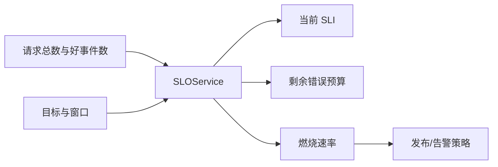
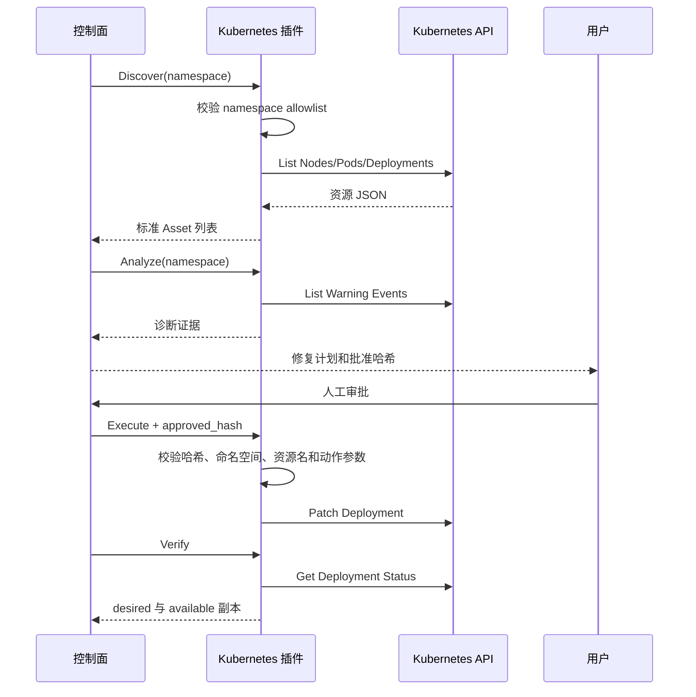

# 阶段三：SRE 指标与 Kubernetes 插件

## 阶段状态与验收

状态：SLO/错误预算、容量趋势、变更风险、通用 CI/CD 事件、Kubernetes 与 Webhook 通知插件已经实现；45 个控制面测试通过，插件可完成真实 gRPC 进程启动、Health、Describe 调用和卸载。因当前机器没有运行 k3s，Kubernetes API 的发现和写操作需要在后续 Linux k3s 环境完成集成验收。

本阶段目标是把项目从“异常后修复”扩展到 SRE 主动治理：通过错误预算决定发布节奏，通过趋势预测提前发现容量风险，通过变更风险控制发布，并在 Kubernetes 命名空间边界内发现和修复工作负载。

插件生态同时提供 Go 与 Python SDK。两端实现相同八个 RPC、1MiB 消息上限、默认不支持
响应和真实 HTTP/2 gRPC 契约测试；Go SDK 额外提供严格 `plugin.yaml` 解析、0600 Unix
Socket、安全旧 Socket 清理和最小可编译脚手架。详细数据流与开发命令见
[`sdk/README.md`](../../../sdk/README.md)。

## 新增能力与技术

| 能力 | 实现 | 关键输出 |
|---|---|---|
| SLO | 好事件比例、错误预算、燃烧速率 | SLI、剩余预算、burn rate、状态 |
| 容量预测 | 最小二乘线性回归、R² | 每小时斜率、置信度、预计耗尽时间 |
| 变更风险 | 可解释加权规则 | 风险分数、等级和分项原因 |
| Kubernetes 发现 | 原生 HTTPS API、ServiceAccount | Node、Pod、Deployment 资产 |
| Kubernetes 诊断 | Warning Event 查询 | 事件原因、消息和关联资源 |
| Kubernetes 修复 | JSON Merge Patch | rollout restart、0..10 副本 scale、验证与副本回滚 |
| Kubernetes 安全 | Namespace allowlist、RBAC、审批哈希 | 集群节点只读、实验命名空间受限写入 |
| DevOps 事件 | 标准化 Webhook API、PostgreSQL | Git、CI/CD、部署 revision 与状态历史 |
| 通知 | 独立 Webhook 插件、主机白名单 | 固定字段投递、审批哈希和不可逆说明 |

## 数据流

### SLO 与错误预算



错误预算允许的坏事件数为 `total × (1-objective)`，燃烧速率为“实际坏事件比例 / 允许坏事件比例”。状态阈值采用常见多窗口告警中的基线值：14.4 以上为 critical，6 以上为 fast burn，1 以上表示当前消耗速度将超出预算。服务只计算事实，不直接停止发布；变更策略可以消费该结果。

### 容量预测

1. 按时间排序磁盘、内存、连接数或队列深度观测。
2. 将时间转换为相对首点的小时数，避免 Unix 时间大数降低数值可读性。
3. 使用最小二乘拟合 `capacity = intercept + slope × hours`。
4. 计算 R² 描述线性趋势解释度；小于 0.6 时仍返回预测，但标记 `low_confidence`。
5. 斜率小于等于零时返回 `stable`，已经越过阈值时返回 `exhausted`。

容量预测不是容量承诺。周期性流量、突然扩容和数据保留策略变化都会破坏线性假设，调用方必须同时展示 R² 和原始趋势。

### 变更风险

```text
风险 = 0.35 × 爆炸半径
     + 0.25 × 近期故障率
     + 0.20 × 变更组件范围
     + 0.20 × 无回滚惩罚
```

每个分量都来自可观测事实并输出中文原因。当前是可解释规则基线，而不是训练模型；在积累真实变更和故障标签之前，复杂模型只会制造虚假精度。

### Kubernetes 插件



插件直接调用 Kubernetes HTTPS API，不启动 `kubectl` 子进程。ServiceAccount Token 从标准挂载路径读取，TLS 使用集群 CA。节点只允许读；Pod/Event 只读；Deployment 的 get/list/watch/patch 只授予 `aiops-lab` 命名空间。

## 公共接口

新增 HTTP API：

- `POST /api/v1/sre/slo/evaluate`
- `POST /api/v1/sre/capacity/forecast`
- `POST /api/v1/sre/changes/assess`
- `POST/GET /api/v1/integrations/events`

Kubernetes 插件仍复用阶段一 `PluginService`，未增加供应商专用 RPC。发现、分析、计划、执行、验证和回滚使用版本化 Struct 信封；稳定后再收敛为强类型 protobuf 消息。

## 关键代码阅读顺序

1. `application/slo_service.py`：错误预算和燃烧速率。
2. `application/capacity_forecast_service.py`：斜率、截距、R² 与边界状态。
3. `application/change_risk_service.py`：风险权重和中文原因。
4. `plugins/kubernetes/plugin.py`：API 认证、命名空间边界和类型化 Patch。
5. `deployments/kubernetes/aiops-plugin-rbac.yaml`：为什么节点权限和工作负载权限必须拆分。

## 架构难点与取舍

### SLO 不是普通可用率卡片

只显示 99.8% 无法判断是否需要停止发布。错误预算把可靠性目标转成可以消耗的资源，燃烧速率进一步说明当前速度。计算服务因此同时返回 SLI、预算和 burn rate，而不是只返回百分比。

### 容量预测必须输出拟合质量

线性回归总能画出一条线，但未必有预测意义。R² 低于 0.6 时系统明确标记低置信，不允许界面只展示一个看似精确的日期。

### Kubernetes 写权限不能跟发现权限混在一起

节点发现需要集群级列表权限，Deployment 修复只需要一个实验命名空间。使用 ClusterRole 统一授权会扩大写权限，因此 RBAC 将节点只读 ClusterRole 与命名空间 Role 分离。

### rollout restart 无法简单“撤销”

重启本质是修改 Pod 模板注解并触发新 ReplicaSet，不能通过删除注解恢复旧 Pod。当前 Rollback RPC只恢复控制面事先捕获的副本数；版本回滚需要在后续加入可信旧模板快照或 ReplicaSet 版本选择，不能伪装成已支持。

## 运行与验收

SRE API 示例：

```bash
curl -X POST http://127.0.0.1:8088/api/v1/sre/slo/evaluate \
  -H 'Content-Type: application/json' \
  -d '{"name":"API 可用性","objective":0.999,"window_days":30,"good_events":9990,"total_events":10000}'
```

k3s 中创建命名空间和 RBAC：

```bash
kubectl create namespace aiops-system
kubectl create namespace aiops-lab
kubectl apply -f deployments/kubernetes/aiops-plugin-rbac.yaml
```

插件进程必须运行在使用 `aiops-plugin` ServiceAccount 的 Pod 内，并设置：

```text
AIOPS_KUBERNETES_NAMESPACES=aiops-lab
AIOPS_PLUGIN_SOCKET=/runtime/kubernetes.sock
```

验收场景包括资产发现、Warning Event、允许命名空间 restart/scale、越权命名空间拒绝、副本上限拒绝、非法批准哈希拒绝和修复后 available 副本验证。

SDK 契约验证：

```bash
cd sdk/go && go test ./... && go vet ./...
cd ../python && PYTHONPATH=src ../../.venv/bin/python -m pytest -q
cd ../../control-plane && ../.venv/bin/python -m pytest -q tests/test_plugin_contract.py
```

本地结果为 Go SDK 4 项、Python SDK 2 项测试通过；三个官方插件均完成真实进程启动、
Unix Socket gRPC Health/Describe、配置 Schema 读取和进程清理。云端控制面镜像也复验了
三个插件的 `health=ok` 与 `config_schema.type=object`。

## 限制与后续

- 当前环境未运行 k3s，因此 Kubernetes 网络和 RBAC 集成测试尚未执行。
- rollout 版本回滚尚未实现，只支持恢复旧副本数。
- SLO 数据目前通过 API 传入，后续应由 Prometheus 查询适配器产生。
- 变更风险尚未接入 GitHub/GitLab/Jenkins Webhook 历史，需要阶段四演示边界之外继续扩展。
- 公网访客限流、管理员边界、五类真实实验故障和自动重置已经完成；后续重点转为 mTLS Agent 长连接、插件注册恢复和真实 k3s 集成验收。
