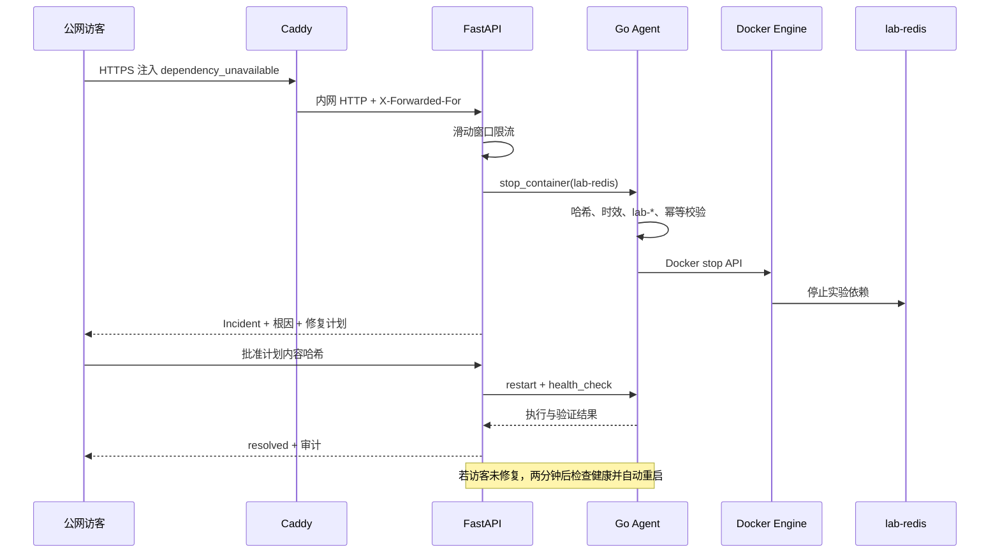

# 阶段四：公网沙箱与开源交付

## 阶段状态与验收

状态：公网入口、管理员令牌边界、访客故障注入限流、实验目标白名单、真实依赖故障、两分钟自动恢复、Caddy HTTPS 覆盖配置、CI 和中英文仓库摘要已经实现。当前单机实验室是共享沙箱，不提供多访客独立容器副本。

本阶段的目标不是把个人项目包装成生产 SaaS，而是在一台低配服务器上安全地向面试官展示真实闭环，同时明确哪些边界仍不适合生产。

## 角色与权限

| 角色 | 可访问能力 | 明确禁止 |
|---|---|---|
| 访客 | 查看 Incident、注入限流故障、批准 `lab-*` 修复、查看 SRE 计算结果 | 插件安装、外部 Webhook、非实验目标、Agent 和 Docker Socket |
| 管理员 | 访客能力、插件安装/RPC、Git/CI/CD 事件写入 | 绕过计划哈希和 Agent 白名单 |
| Agent | 读取 `/host/proc`、操作 `lab-*` Docker 目标 | 任意 Shell、非 `lab-*` 资源、外部公网监听 |
| 插件 | 清单声明的网络或 Kubernetes 权限 | 未声明能力、任意路径入口、无哈希源码 |

管理员接口使用 `Authorization: Bearer <AIOPS_ADMIN_TOKEN>`。如果没有配置令牌，接口返回 503 并保持关闭，而不是使用写在仓库里的默认密码。令牌仅从环境变量读取，不写日志或返回前端。

## 公网数据流



CPU 突增场景仍为带真值的指标模拟，不会在共享服务器上启动不可控忙循环；依赖不可用场景会真实停止 `lab-redis`，可以观察 Nginx/API/Redis 依赖链和 Agent 修复。

## 限流与自动恢复

- FastAPI 使用进程内滑动窗口，同一来源 60 秒最多注入 3 次故障；入口只信任 Nginx 覆盖并格式校验后的 `X-Real-IP`，不读取可伪造的 `X-Forwarded-For` 首项。
- 控制面不直接信任任意请求体作为目标，五类故障到资产、指标、根因和注入方式的映射在不可变真值目录中固定。
- 容器停止动作使用 HMAC 签名任务、nonce 和唯一幂等键，但不伪装成人工修复审批；应用故障端点另用私网控制令牌。
- 每次真实故障创建两分钟恢复任务；应用状态自身还有 120 秒以内硬截止时间。容器恢复任务先健康检查，只有仍停止时才重启，避免用户已经修复后再次打断服务。
- 控制面重启会清空限流窗口和后台任务；应用故障仍会自行过期，但 Docker 的 `restart: unless-stopped` 不能恢复被人工 stop 的容器，因此生产演示还应增加外部定时健康守护。

## HTTPS 与网络边界

默认本地启动仍使用 `8088:80`。公网启动使用覆盖文件：

```bash
cd deployments
cp ../.env.example .env
# 编辑 .env，设置真实域名、数据库密码、管理员令牌、Agent 密钥和实验控制令牌。
docker compose -f compose.yaml -f compose.public.yaml up --build -d
```

Caddy 使用 `AIOPS_PUBLIC_DOMAIN` 自动申请证书，并添加 nosniff、DENY frame、Referrer Policy 和 Permissions Policy。公网只需要开放 80/443；不要开放 8000、9105、5432、9090、3100 或 Docker Socket。

当前基础 Compose 仍发布 `8088` 和实验网关 `18080` 便于学习。公网部署应在云防火墙中只允许 80/443，或者进一步用单独的生产覆盖文件移除这些端口。

## CI 与质量门禁

GitHub Actions 分成四个独立任务：

- Python：Pytest、Ruff、严格 Mypy。
- Go：gofmt、go vet、go test。
- Web：锁定 pnpm 依赖并执行 TypeScript/Vite 生产构建。
- 文档与部署：中文模块说明、插件 SHA-256、阶段 README 和 Compose 配置。

源码修改若未同步插件清单哈希，文档检查会失败；新增阶段若缺 README，也不能标记完成。

## 开源仓库展示结构

根 README 提供英文摘要、能力清单、快速启动、总体架构、阶段矩阵、安全声明和文档入口。每个阶段 README 单独解释数据流、技术、算法、难点、失败过程、测试和下一阶段边界，面试时可按以下顺序演示：

1. 打开控制台并展示三层实验拓扑。
2. 注入 Redis 依赖不可用，观察真实 HTTP 503。
3. 展示 Incident 证据、根因和计划哈希。
4. 批准修复，观察 Agent 重启与健康检查。
5. 重复批准请求，证明幂等执行。
6. 安装 HTTP/Nginx 插件，证明不重启控制面即可调用 Health/Analyze。
7. 展示检测器评测报告，主动解释召回与误报的不足。
8. 展示 Kubernetes RBAC 和命名空间拒绝逻辑。

## 安全难点与限制

- 已提供 `deployments/compose.lite.yaml`：适合已有监控栈的 4GB 主机，只启动核心闭环。无域名时通过现有 Nginx 的 `/aiops/` 路径公开 Web，两个调试端口仍限制在回环地址，并从服务端关闭明文 HTTP 下的管理员写接口。

### Docker Socket 仍是最高风险

即使 Agent 已验证 HMAC 签名任务并限制目标和动作白名单，持有 Docker Socket 的进程一旦自身被攻破仍拥有高权限。真实生产版本仍必须使用 Docker Socket Proxy、独立特权助手、mTLS 和操作系统级沙箱。

### 来源 IP 只在受控反向代理后可信

控制面没有直接发布端口，来自 Caddy 内网的 `X-Forwarded-For` 才能用于限流。如果将控制面直接暴露公网，攻击者可以伪造该头绕过限流。

### 共享沙箱不是多租户隔离

所有访客共享一个 `lab-*` 拓扑。限流和自动恢复减少冲突，但不能保证两个访客同时演示时互不影响。若需要严格会话隔离，应按会话动态创建带资源配额的命名空间或 Compose Project，这超出 4GB 单机默认范围。

### 管理员令牌不是完整身份系统

阶段四只提供单管理员静态 Bearer Token，不含用户管理、OIDC、TOTP 和令牌轮换。它适合个人 Demo，不适合团队生产平台。
当 `AIOPS_ADMIN_ACTIONS_ENABLED=false` 时，控制面会在校验令牌前直接拒绝管理员写接口；
轻量 HTTP 公网部署强制使用该模式，避免令牌经过未加密链路。

## 验收清单

- 未配置管理员令牌时插件安装接口返回 503。
- 错误或缺失令牌不能安装插件或写入外部变更事件。
- 明文 HTTP 公网模式即使携带正确令牌也返回 403。
- 同一来源一分钟第四次故障注入返回 429。
- 访客不能批准任何非 `lab-*` 计划。
- Redis 真实停止后可以经批准恢复；无人操作时两分钟后自动恢复。
- Agent、PostgreSQL、Prometheus、Loki 和插件 Socket 均无公网端口。
- HTTPS 域名、证书续期和安全响应头在公网服务器验证。
