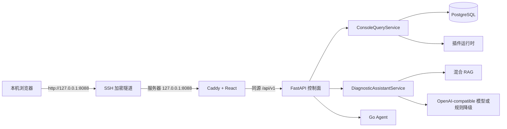
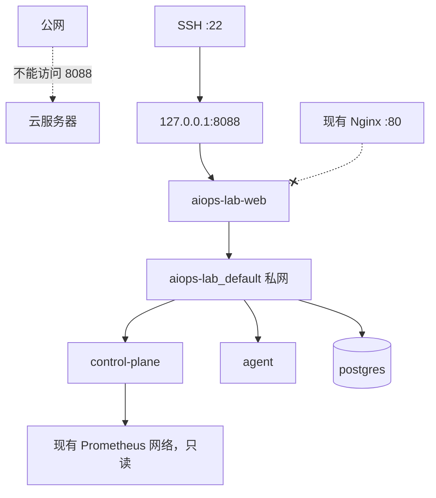
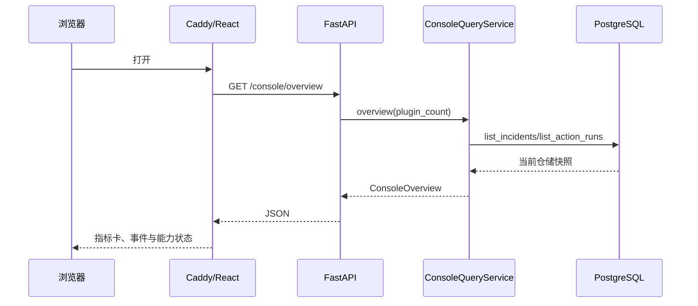
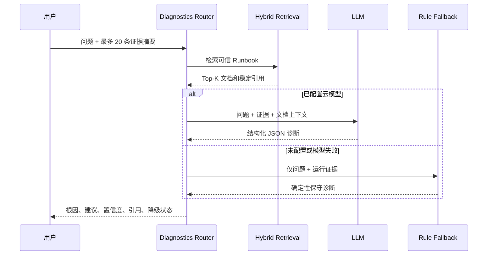

# 阶段五：多页面私有控制台

## 阶段目标、范围与完成状态

本阶段解决两个直接问题：原前端只有一个 Incident 演示页，无法观察已经实现的资产、
拓扑、RAG、插件与 SRE 能力；无域名公网 HTTP 又不适合承载管理员审批和运维数据。

完成状态：已完成并部署到 `/home/ubuntu/aiops`。当前 Web 仅监听服务器
`127.0.0.1:8088`，公网 `/aiops/` 入口已经移除，远程使用通过 SSH 端口转发。

本阶段不新增多租户、RBAC、高可用、计费或移动端应用，也不把实验算法伪装成在线能力。

## 新增控制台

| 页面 | 主要数据源 | 是否写入状态 |
|---|---|---|
| 总览 | `/api/v1/console/overview` | 否 |
| 资产与节点 | `/api/v1/console/assets` | 否 |
| 服务拓扑 | `/api/v1/console/topology` | 否 |
| 指标与日志 | 能力目录与 Incident 证据引用 | 否 |
| Incident 工作台 | Incident、计划和执行关联视图 | 仅批准实验计划 |
| AI 诊断助手 | RAG 检索与诊断模型端口 | 否，不执行建议 |
| 审批中心 | 待审批计划、内容哈希和回滚定义 | 是，受状态机约束 |
| 执行与审计 | ActionRun 与 CI/CD 变更事件 | 否 |
| 插件中心 | 独立进程插件运行时 | 当前页面只读 |
| SLO 与容量 | SLO、容量与变更风险领域服务 | 只计算，不执行变更 |
| 故障实验室 | 五类固定真值场景 | 仅影响 `lab-*` |
| 算法评测 | 能力目录 | 否 |
| 系统设置 | 无密钥安全配置视图 | 否 |

## 组件架构



依赖仍保持 `api/adapters → application → domain`。控制台聚合逻辑放在应用服务，HTTP
Router 只做输入输出转换；React 页面通过类型化 API 适配器访问数据，不直接拼接数据库结构。

## 部署图与网络边界



Web 不再加入 `devops-lab_default`，因此现有公网 Nginx 无法解析或连接 AIOps Web。
控制面仍为读取现有 Prometheus 加入该网络，但没有端口映射，也没有公网 location。

## 页面数据流



控制台不复制原始 Prometheus/Loki 数据。遥测页读取 Incident 保存的 `EvidenceRef`：数据源、
查询语句、时间窗口和摘要。这样既避免 PostgreSQL 膨胀，也能保留可复现查询边界。

## AI 诊断数据流与安全约束



规则降级不能读取全部检索文档作为关键词来源，否则 CPU 问题可能被 Redis Runbook 污染。
浏览器联调发现该问题后，降级路径改为只读取用户问题和运行证据；引用仍保留用于人工阅读。
任何诊断结果都不会直接发送给 Agent，必须先形成类型化 `RemediationPlan` 并完成人工审批。

## 技术选择与取舍

- 使用 React 19、TypeScript 与功能切片，每页独立维护数据和交互，根组件不承载业务状态。
- 使用轻量 Hash Router，避免新增依赖，并兼容 SSH 隧道根路径与未来 `/aiops/` 子路径。
- 使用 FastAPI 聚合查询接口，避免首页并发请求跨越多个时间点产生不一致快照。
- 使用 dataclass 只读视图模型，不让 Pydantic 或数据库对象进入领域层。
- 使用 CSS Grid 和现有设计变量，不引入体积较大的组件库，生产 JS gzip 约 70KB。
- 内置 RAG 使用关键词与哈希 Embedding，4GB 主机无需下载向量模型；云模型接口仍可替换。

## 核心接口与模型

- `ManagedAssetView`：资产 ID、类型、节点、内部地址、职责和健康摘要。
- `CapabilityView`：能力类别以及 `online/degraded/experiment/disabled` 真实状态。
- `ConsoleOverview`：Incident、执行、资产、插件和访问模式汇总。
- `GET /api/v1/console/incident-contexts`：关联 Incident、最新计划、内容哈希与 ActionRun。
- `POST /api/v1/diagnostics/query`：只读诊断，不接受工具名、命令或执行目标。
- `GET /api/v1/console/settings`：只返回安全布尔值，永远不返回 Token、API Key 或共享密钥。

## 关键代码导航与阅读顺序

1. `control-plane/src/aiops_control/domain/console.py`
2. `control-plane/src/aiops_control/application/console_query_service.py`
3. `control-plane/src/aiops_control/api/routers/console.py`
4. `control-plane/src/aiops_control/api/routers/diagnostics.py`
5. `web/src/app/navigation.ts`
6. `web/src/app/AppShell.tsx`
7. `web/src/shared/api/console.ts`
8. `web/src/pages/OverviewPage.tsx`
9. `web/src/pages/IncidentsPage.tsx`
10. `web/src/pages/DiagnosticsPage.tsx`
11. `web/src/pages/ApprovalsPage.tsx`
12. 其余 `web/src/pages/*Page.tsx`

## 架构难点与解决方案

### 前端页面多但不能形成巨型组件

导航、路由、共享壳层、API、类型和页面分别放置。`App.tsx` 只做 Page ID 到组件映射；
写操作仍在 Incident、实验室和 SRE 功能中，避免一个全局 Store 隐藏状态来源。

### 展示功能存在与线上启用的差异

EWMA、Isolation Forest 和自编码器虽然有代码，但没有进入默认在线检测数据流。能力接口
显式返回 `experiment`，Loki 未启用返回 `disabled`，无云模型返回 `degraded`。

### 无域名环境的管理访问

明文公网 HTTP 无法保护管理员令牌和运维数据。当前选择关闭公网 location、断开 Web 的
公网 Docker 网络并绑定回环端口；SSH 同时提供身份认证、传输加密和临时生命周期。

### Nginx 配置回滚

修改现有入口前先下载真实配置并删除唯一 `/aiops/` block，再使用临时 Nginx 容器执行
`nginx -t`。服务器保留 `default.conf.pre-private-console-20260823`，需要恢复时可以回滚。

## 部署、访问与停止

服务器部署：

```bash
cd /home/ubuntu/aiops
docker compose --env-file .env \
  -f deployments/compose.yaml \
  -f deployments/compose.lite.yaml \
  up -d --build
```

本机建立临时隧道：

```bash
ssh -L 8088:127.0.0.1:8088 ubuntu@<服务器公网 IP>
```

然后访问 `http://127.0.0.1:8088`。关闭 SSH 会话后隧道立即失效；不要在云安全组开放 8088。

停止项目但保留数据：

```bash
cd /home/ubuntu/aiops
docker compose --env-file .env \
  -f deployments/compose.yaml \
  -f deployments/compose.lite.yaml down
```

## 测试与验收证据

- Python：Ruff、严格 Mypy 通过，48 个控制面测试通过。
- Web：ESLint、Vitest、TypeScript 与 Vite 生产构建通过。
- 生产静态资源：CSS gzip 约 4.6KB，JavaScript gzip 约 69.5KB。
- 浏览器：总览、拓扑、AI 诊断、SRE 和设置页面完成 DOM 与控制台错误检查。
- 云端：7 个 AIOps 核心容器运行，控制面和 Agent 健康。
- 网络：Web 只在 `127.0.0.1:8088` 监听，不属于 `devops-lab_default`；公网 `/aiops/` 返回 404。
- SSH 隧道：健康接口、控制台总览和首页分别返回成功，访问模式为 `private-forward`。
- 数据保留：原有 9 个 Incident 与 9 个成功 ActionRun 在重建后仍可查询。

## 知识点与面试讲解

- 为什么管理控制台使用 SSH 隧道，而不是无域名公网 HTTP。
- 如何用端口与适配器保持领域层不依赖 FastAPI、数据库和模型供应商。
- 为什么 Incident 保存证据引用，而不是复制原始遥测数据。
- 如何区分算法“已经实现”“离线实验”和“线上启用”。
- RAG 文档如何污染规则引擎，以及如何隔离运行证据和知识上下文。
- 审批内容哈希、任务 HMAC、nonce、有效期和幂等键分别解决什么威胁。

## 已知限制与下一阶段接口

- 资产目录当前包含明确的单机实验资产，尚未把 Agent Discovery 流持久化到数据库。
- 插件安装和升级仍通过管理员 API，页面当前只读，后续需要安全的临时管理员会话。
- 遥测页展示证据引用，尚未加入 PromQL/LogQL 可视化编辑器和时序图表。
- RAG 内置三份 Runbook，后续接入版本化 Runbook、历史 Incident 与复盘文档。
- Agent 仍是私网 HMAC HTTP 调度，未完成计划中的主动 mTLS gRPC 长连接。
- 正式公网演示必须配置域名、HTTPS、隔离沙箱、会话限流和自动重置后才能恢复入口。
