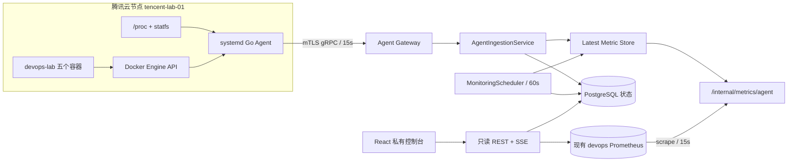
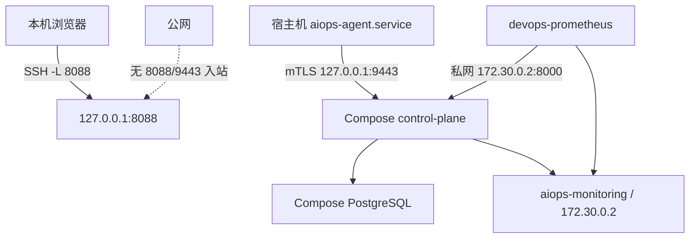
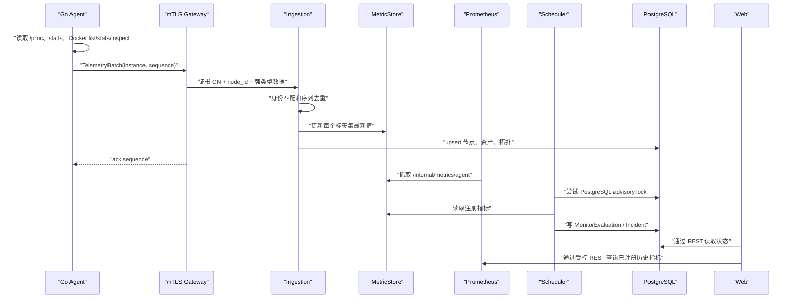

# 阶段六：真实环境持续监测与安全运维

## 阶段目标、范围、前置条件与状态

本阶段把阶段五的静态资产演示扩展为真实环境监测：宿主机 systemd Agent 持续发现腾讯云
节点和 `/srv/devops-lab` 五个容器，将真实指标、状态和拓扑送入控制面，控制台明确区分真实
环境与故障实验室。真实环境不提供故障注入，默认 `observe_only`，不会生成或执行写计划。

范围包括 Linux 主机、Docker、Nginx/API、Prometheus、Grafana 和 Alertmanager。Kubernetes、
多节点证书生命周期、自动真实重启和公网入口不属于本阶段。

前置条件：Linux、Docker、systemd、OpenSSL、Go 1.24+、现有 devops-lab Prometheus，以及只能
通过 SSH 端口转发访问的 AIOps Web。代码与云端实时监测闭环已经部署并完成非扰动验收；
24 小时云端浸泡仍在进行，完成前不得开启 `approval_only`。

## 新增组件、目录、接口和模型

| 边界 | 新增内容 | 职责 |
|---|---|---|
| 公共协议 | `proto/agent/v1/agent.proto` | 强类型身份、遥测、确认和动作帧 |
| Go Agent | Docker Collector、TelemetryService、gRPC Client | 原生采集、稳定 ID、mTLS 主动上报 |
| 控制面领域 | AgentNode、MonitoredAsset、MonitorRule、MonitorEvaluation | 不依赖框架的真实监测状态 |
| 控制面应用 | AgentIngestion、Monitoring、Scheduler、RealActionPolicy | 身份、去重、迟滞、租约和安全门禁 |
| 适配器 | MetricStore、PostgreSQL mixin、gRPC Gateway、HealthChecker | 指标暴露、持久化、传输和固定探针 |
| Web | `features/monitoring` 与三个真实页面 | 节点、资产、拓扑、趋势、规则和健康 |
| 部署 | PKI 脚本、systemd、SQL 002 | 私钥生成、主机服务和在线迁移 |

核心 REST 接口：

- `GET /api/v1/nodes`
- `GET /api/v1/assets` 与 `GET /api/v1/assets/{asset_id}`
- `GET /api/v1/topology`
- `GET /api/v1/monitoring/rules`
- `GET /api/v1/monitoring/evaluations`
- `GET /api/v1/monitoring/health`
- `GET /api/v1/assets/{asset_id}/metrics`
- `GET /api/v1/assets/{asset_id}/incidents`
- `GET /internal/metrics/agent`，仅供 Prometheus 私网抓取

## 组件架构图



## 部署图



容器内 gRPC 必须监听 `0.0.0.0:9443` 才能接收 Docker 端口转发，但宿主机发布固定为
`127.0.0.1:9443:9443`。所谓“只绑定回环”指宿主机攻击面，不是容器网络命名空间内地址。

## 完整数据流



数据产生于主机累计计数和 Docker Engine。Agent 只计算瞬时比例，不保存历史。控制面把最新
值留在内存并暴露给 Prometheus；Prometheus 保存原始时序，PostgreSQL 只保存低频状态、规则、
评估、Incident 和证据引用。浏览器不能提交 PromQL、LogQL 或健康 URL，只能选注册指标。

## 稳定资产 ID 与拓扑

- `host/tencent-lab-01`
- `docker/devops-lab/nginx`
- `docker/devops-lab/api`
- `docker/devops-lab/prometheus`
- `docker/devops-lab/grafana`
- `docker/devops-lab/alertmanager`

关系和 RCA 权重：Nginx `depends_on` API 为 1.0；Grafana `queries` Prometheus 为 0.55；
Prometheus `observes` API 为 0.35；Prometheus `notifies` Alertmanager 为 0.45。业务依赖权重
更高，避免把“监控系统发现故障”错误解释为“监控系统导致业务故障”。

## 在线规则与算法

| 规则 | 输入 | 判断 | 连续周期 | 恢复 |
|---|---|---|---|---|
| 主机 CPU | `aiops_host_cpu_percent` | > 85% | 5 次 | 3 次正常 |
| 可用内存 | `aiops_host_memory_available_percent` | < 10% | 5 次 | 3 次正常 |
| 磁盘警告/严重 | `aiops_host_disk_used_percent` | > 80% / 90% | 1 次 | 3 次正常 |
| 容器停止 | `aiops_container_up` | < 1 | 2 次 | 3 次正常 |
| 重启循环 | `aiops_container_restart_count` | 10 分钟增加 >= 3 | 1 次 | 3 次正常 |

阈值规则时间复杂度为每周期 `O(R × M)`，R 是启用规则数，M 是同名最新指标标签集；当前
规模只有个位数规则和资产。重启增量每个规则/资产维护一个时间双端队列，追加和过期淘汰均摊
`O(1)`。在线主线保持确定性阈值和滚动 Z-Score；EWMA、季节基线、Isolation Forest 仍可在
实验模块选择，但不会同时开启制造重复告警。

## mTLS、去重和并发关键路径逐步解释

1. Agent 加载 CA、客户端证书和私钥，最低 TLS 1.3，并校验服务端 SAN
   `aiops-control-plane`，不存在跳过验证开关。
2. gRPC 握手要求客户端证书；无证书、错误 CA 或过期证书在业务代码前被拒绝。
3. 首帧传 `node_id`；控制面再比较登记表中的证书 CN，防止一张合法证书冒充另一节点。
4. `instance_id` 每次进程启动随机生成，`sequence` 在该实例内单调递增。
5. 控制面在一把锁内比较最大序列和更新全部最新指标。旧序列只返回 ACK，不再次写入。
6. 调度进程使用 PostgreSQL 会话级 advisory lock。锁会话贯穿整个评估回调，结束后显式释放；
   进程崩溃时数据库自动释放会话锁。
7. 告警采用命中迟滞和恢复迟滞。容器需要连续两轮 down，恢复需要连续三轮正常，避免抖动。

## 技术选型、替代方案和取舍

- 选择 Go 原生 `/proc`、`statfs` 和 Docker HTTP API，而非 node_exporter/cAdvisor：少两个常驻
  组件，符合 4GB 主机约束；代价是需要自己测试 CPU 累计计数和 Docker stats 公式。
- 选择 mTLS gRPC 流而非轮询 Agent HTTP：节点主动出站、跨语言强类型和连接复用更适合扩展；
  代价是 PKI 与生成代码复杂度增加。
- 复用现有 Prometheus，不部署第二套时序库。最新值内存存储重启后可由 Agent 15 秒内恢复。
- PostgreSQL 使用 JSONB 聚合加稳定索引，兼容旧数据；不把高频指标复制进数据库。
- Web 使用原生 SVG 趋势线，不引入大型图表库，继续控制前端体积和内存。
- Loki/OTel 日志链路作为指标稳定后的可选项，本阶段默认不在 4GB 云机开启。

## 安全边界与真实动作门禁

`AIOPS_REAL_ACTIONS_MODE=observe_only` 是默认和部署覆盖中的固定值：

- 真实异常只创建 `OPEN` Incident，不创建 RemediationPlan。
- 即使旧数据中存在真实计划，HTTP 审批路由和 `RealActionPolicy` 都会拒绝。
- Agent 再次检查目标、动作、HMAC、批准哈希、nonce、有效期和幂等键。
- AI 只能给诊断文字，不能修改模式、注册工具或直接调用 Docker。
- 故障实验只允许 `lab-*`，绝不把真实资产加入注入场景。

至少稳定运行 24 小时后，管理员才能手工把控制面和 systemd Agent 同时改为
`approval_only`。第一道门只允许 `health_check`、`inspect_container` 和 `collect_logs`；真实
`restart_container` 仍拒绝。开启重启需要新的 ADR、独立配置值和再次验收，不能复用布尔开关。

## 部署、迁移与回滚

首次在服务器项目目录生成 PKI：

```bash
cd /home/ubuntu/aiops
sudo ./scripts/generate-agent-pki.sh
```

对已有 PostgreSQL 数据卷执行幂等在线迁移：

```bash
docker compose --env-file .env -f deployments/compose.yaml -f deployments/compose.lite.yaml \
  exec -T postgres psql -U aiops -d aiops \
  < deployments/postgres/migrations/002_real_monitoring.sql
```

重建控制面，确认 9443 只监听回环，再安装 systemd Agent：

```bash
docker compose --env-file .env -f deployments/compose.yaml -f deployments/compose.lite.yaml \
  up -d --build control-plane web
sudo ./scripts/install-agent.sh
ss -lntp | grep -E '127.0.0.1:9443|127.0.0.1:8088'
```

在 `/srv/devops-lab/monitoring/prometheus.yml` 备份后加入固定抓取目标：

```yaml
  - job_name: aiops-real-agent
    metrics_path: /internal/metrics/agent
    static_configs:
      - targets: ["172.30.0.2:8000"]
```

必须先执行 `promtool check config`，再只重载 Prometheus，不重启 API、Nginx、Grafana 或
Alertmanager。验证接口：

当前云机的长期运行 Prometheus 容器无法从新进程解析 Docker DNS，甚至无法重新解析原有
`api` 名称。部署因此建立不发布端口的 `172.30.0.0/24` 私网：控制面固定 `.2`，Prometheus
固定 `.3`。这避免为了刷新 DNS 重建 Prometheus；固定地址由 Compose 和部署脚本共同声明。

```bash
curl http://127.0.0.1:8088/api/v1/nodes
curl http://127.0.0.1:8088/api/v1/assets
curl http://127.0.0.1:8088/api/v1/monitoring/health
curl http://127.0.0.1:8088/internal/metrics/agent
```

回滚时停止并禁用 `aiops-agent.service`，恢复 Prometheus 配置备份，移除 lite 覆盖的 gRPC
端口后重建控制面。数据库新增表不影响旧 JSONB 聚合，可保留；不要删除现有 Incident 和
ActionRun 数据。Compose 内旧 Agent 与 `lab-*` 实验闭环继续工作。

## 测试、验收和证据

自动测试覆盖：

- Go `/proc` CPU 差值、内存、稳定资产 ID、容器指标组装、拓扑和真实动作双门禁。
- Python Protobuf 强类型字段、证书业务身份不匹配、序列去重、规则命中、三周期恢复、
  `observe_only` 无写计划、带斜线资产 ID API 和未注册指标拒绝。
- 全量 Ruff、严格 Mypy、Pytest、Go test/vet、ESLint、Vitest、TypeScript 与 Vite 构建。

2026-08-25 完成的自动验收结果：

- 控制面 Pytest 53 项、SDK/插件及跨组件 Pytest 7 项、Web Vitest 2 项全部通过。
- Go `go test -race ./...` 与 `go vet ./...` 通过；Ruff、严格 Mypy、ESLint、Prettier、
  TypeScript、Vite 和 Compose 配置检查通过。
- 中文文档检查扫描 192 个手写文件并通过；生成代码、锁文件和第三方文件按规范豁免。

同日完成的腾讯云非扰动验收证据：

| 验收项 | 实际结果 |
|---|---|
| Agent | `aiops-agent.service` 在线，版本 0.2.0，重启次数 0，证书 CN 为 `aiops-agent-tencent-lab-01` |
| 发现结果 | 1 个节点、1 个 Linux 主机、5 个 `devops-lab` 容器，全部为 `running` |
| 拓扑与规则 | 4 条真实拓扑边、6 条确定性规则均已持久化并在线评估 |
| 健康探针 | Nginx、API、Prometheus、Grafana、Alertmanager 均返回 HTTP 200 |
| 时序链路 | Prometheus 的 `aiops-real-agent` target 为 `up`，主机 CPU 已产生历史样本 |
| 安全边界 | 8088、9105、9443 仅监听 `127.0.0.1`；公网 `/aiops/` 返回 404 |
| 浏览器验收 | 资产、拓扑、指标三页均显示实时数据，CPU SVG 趋势正常，控制台错误数为 0 |
| 资源占用 | 控制面约 51 MiB、Agent 约 8 MiB、PostgreSQL 约 21 MiB、Web 约 27 MiB |

部署前保留了 `/home/ubuntu/aiops-pre-stage6-20260825-213021.tar.gz`、环境文件备份和
Prometheus 配置备份。上述结果证明实时闭环可用，但不替代尚在进行的 24 小时稳定性窗口。

云端验收必须采用非扰动方式：观察既有业务、读取健康端点和指标，不停止容器、不制造 CPU、
内存或磁盘压力。24 小时记录 Agent 重连次数、指标缺口、控制面/Agent RSS、Incident 误报和
现有 devops-lab 可用性。时间窗未完成前，验收状态必须写“进行中”，不能伪造通过。

## 关键代码导航

推荐完整顺序见 `docs/code-reading-order.md`。本阶段最短路径是：公共 proto → Agent domain →
procfs/Docker collector → TelemetryService → gRPC client → monitoring domain → ingestion →
MetricStore → MonitoringService → scheduler → monitoring router → Web monitoring feature/pages。

## 架构难点、排查与可复用经验

### 宿主机回环与容器监听不是同一个网络命名空间

若控制面在容器内也只监听 `127.0.0.1`，Docker 端口转发无法到达它。解决方式是容器内监听
全部接口，Compose 只把宿主机发布地址限定为 `127.0.0.1`。安全评审应检查宿主机 `ss` 和
云安全组，而不能只看应用参数。

### 确认丢失与重复批次

仅依赖 TCP 不足以证明应用已经持久化。协议显式 ACK 序列；控制面以实例和序列去重，Agent
只有看到确认才推进。该模式也适用于事件转发、配置同步和后续异步动作。

### gRPC aio 与 Uvicorn 事件循环

云端首次启动发现，若在 FastAPI 组合根构造阶段创建 `grpc.aio.server()`，随后 Uvicorn 启用
uvloop，gRPC Future 会仍绑定旧循环并拒绝启动。网关现在只在 lifespan `start()` 内创建
Server，确保它绑定最终运行循环；`close()` 只停止已经启动的实例。

### 长期运行容器的 Docker DNS 与配置文件 inode

云端现有 Prometheus 容器中的新进程无法解析新增服务名，甚至不能重新解析原有 `api` 名称。
为了不重建整套 devops-lab，本阶段建立不发布端口的 `aiops-monitoring` 私网，固定控制面为
`172.30.0.2`、Prometheus 为 `172.30.0.3`，只让 Prometheus 访问内部指标端点。

首次替换 `prometheus.yml` 时使用了会改变 inode 的文件安装方式；Docker bind mount 仍引用
旧 inode，因此进程重载后看不到新内容。脚本现改为先在临时文件校验，再用 `dd` 原位覆盖，
保留 inode。首次部署只定向重建 Prometheus 容器使其取得新挂载；数据卷路径保持不变，期间
Nginx 与 API 健康检查持续正常。这个经验同样适用于 Nginx、Alertmanager 等 bind mount 配置。

### 监控系统不应成为高资源故障源

原始时序只进现有 Prometheus；控制面只留最新值。HTTP 健康目标固定且两秒超时，调度周期
一分钟并使用非阻塞数据库锁。任何外部源失败都进入等待或降级状态，不做无边界重试。

## AIOps、AI、DevOps、SRE 与面试要点

- AIOps：信号标准化、迟滞检测、Incident 聚合、拓扑传播权重和证据引用。
- AI：在线确定性规则与实验算法分层；RAG 只能解释证据，不能越过动作政策。
- DevOps：Compose 网络、systemd 生命周期、Protobuf 生成、数据库在线迁移和可回滚部署。
- SRE：监测新鲜度、错误预算意识、避免监控自扰、24 小时浸泡和非扰动验收。
- 安全：mTLS 身份、业务身份绑定、HMAC 任务完整性、nonce 防重放、幂等与最小权限。

面试时应能解释：为什么 mTLS 后仍需要 HMAC；为什么业务依赖边权重大；为什么正常三次才
恢复；为什么原始指标不进 PostgreSQL；为什么默认只观察；以及如何在不影响线上业务的情况
下验证这套系统。

## 已知限制与下一阶段预留

- 24 小时云端浸泡需要真实时间，不能由单元测试替代。
- HTTP 5xx、P95 和 Prometheus target down 已有注册查询边界，但需在云端确认现有指标名后
  再建立默认规则，避免凭假定指标制造错误告警。
- Loki/OTel 日志采集默认未启用；启用前必须验证脱敏和 384MB/192MB 资源上限。
- Agent 证书由本地 CA 手工生成；多节点需要证书轮换、吊销和节点登记管理接口。
- `approval_only` 首道只读门已实现，真实重启门禁明确未开放。
