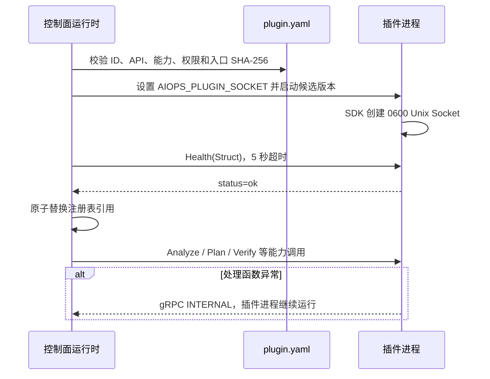

# 插件 SDK、协议与开发脚手架

## 目标与边界

本目录提供 Python 与 Go 两套真正可运行的 gRPC SDK。插件是独立进程，通过控制面分配的
Unix Socket 通信；SDK 不允许插件注册 TCP 端口，不替插件申请 Docker Socket、宿主机或
Kubernetes 权限。权限是否可以授予仍由控制面的清单策略决定。

当前协议版本为 `aiops.plugin.v1.PluginService`，固定包含 `Describe`、`Health`、
`Discover`、`Analyze`、`Plan`、`Execute`、`Verify` 和 `Rollback` 八个 RPC。信封使用
protobuf `Struct`，单条消息硬限制为 1MiB。它适合当前版本化通用载荷；稳定领域出现后
应新增强类型消息，而不是在 Struct 中长期堆积无约束字段。

## 数据流与进程隔离



控制面升级插件时先启动候选版本并完成 Health，之后才交换注册表并停止旧进程。候选启动、
验签或健康失败不会影响旧版本。SDK 对业务异常做 gRPC 状态归一化，但插件仍应使用结构化
日志记录自己的完整堆栈，且不能把密钥写入错误消息。

## Python SDK

Python 插件实现普通字典函数，不需要直接接触 protobuf：

```python
from aiops_plugin_sdk import PluginHandlers, serve

handlers = PluginHandlers.with_defaults(
    describe=lambda _: {"id": "my-plugin", "version": "0.1.0"},
    health=lambda _: {"status": "ok"},
)
server = serve("/run/aiops/my-plugin.sock", handlers)
server.wait_for_termination()
```

`with_defaults` 让未实现的六项能力显式返回 `{"supported": false}`，而不是让 RPC 消失。
生产插件通常从 `AIOPS_PLUGIN_SOCKET` 读取路径；参考 `plugins/http-nginx/plugin.py`。

验证命令：

```bash
cd sdk/python
PYTHONPATH=src ../../.venv/bin/python -m pytest -q
../../.venv/bin/python -m ruff check src tests
```

## Go SDK

Go SDK 使用 `context.Context` 与 `map[string]any`，并在进程结束时平滑停止服务：

```go
handlers := aiopspluginsdk.WithDefaults(describe, health)
handlers.Analyze = analyze
err := aiopspluginsdk.ServeUnix(ctx, os.Getenv("AIOPS_PLUGIN_SOCKET"), handlers)
```

完整入口位于 `sdk/go/examples/minimal/main.go`。`ServeUnix` 要求绝对路径且不超过 100 字节，
只清理旧 Unix Socket，遇到同名普通文件或符号链接会拒绝覆盖；创建后的权限固定为 `0600`。

```bash
cd sdk/go
go test ./...
go vet ./...
go build -o examples/minimal/go-minimal ./examples/minimal
```

国内网络仅在开发命令临时设置 `GOPROXY=https://goproxy.cn,direct`，模块本身不硬编码代理。
编译二进制后计算 `sha256sum go-minimal`，替换 `plugin.yaml.example` 的零值校验和，再把完整
目录复制到 `plugins/go-minimal`。

## 清单字段与权限模型

| 字段 | 含义 | 失败行为 |
|---|---|---|
| `id` | 3..64 位小写插件身份 | 拒绝加载 |
| `version` | 候选版本标识 | 与 ID 共同形成版本 Socket |
| `api_version` | 当前必须为 `v1` | 拒绝启动未知协议 |
| `entrypoint` | 插件目录内入口 | 路径逃逸时拒绝 |
| `checksum` | `sha256:<64 hex>` | 与入口不一致时拒绝 |
| `capabilities` | 六类标准能力声明 | 未知能力拒绝 |
| `permissions` | 网络、Kubernetes 等最小权限 | 超出控制面白名单时拒绝 |
| `config_schema` | 可选配置 JSON Schema | 当前 SDK 解析；UI 自动表单属于后续工作 |

Go 的 `LoadManifest` 使用 YAML KnownFields 严格模式，能在插件仓库 CI 中提前发现拼错字段。
控制面仍会再次校验权限白名单和入口实际摘要，不能把 SDK 本地校验当作授权。

## 契约测试与推荐阅读

1. 先读 `proto/plugin/v1/plugin.proto`，确认 RPC 生命周期。
2. 再读 Python `server.py` 或 Go `server.go`，理解 Struct 转换、大小限制和错误隔离。
3. 阅读 `control-plane/adapters/grpc_plugin_runtime.py`，理解候选健康与原子替换。
4. 运行 `control-plane/tests/test_plugin_contract.py`，它会真实启动三个官方 Python 插件。
5. 运行两套 SDK 自身测试；Go 使用内存 HTTP/2 gRPC，Python 使用随机本机端口，不依赖 Unix
   Socket，因此 Windows 与 Linux CI 都能执行相同线协议。

已知限制：当前控制面重启后不会从 PostgreSQL 自动恢复插件注册表；插件进程权限仍由宿主
进程用户决定；配置 Schema 尚未驱动 Web 表单；跨语言 Struct 字段约束主要靠文档和契约
测试。这些限制必须在接入第三方高权限插件前解决。
